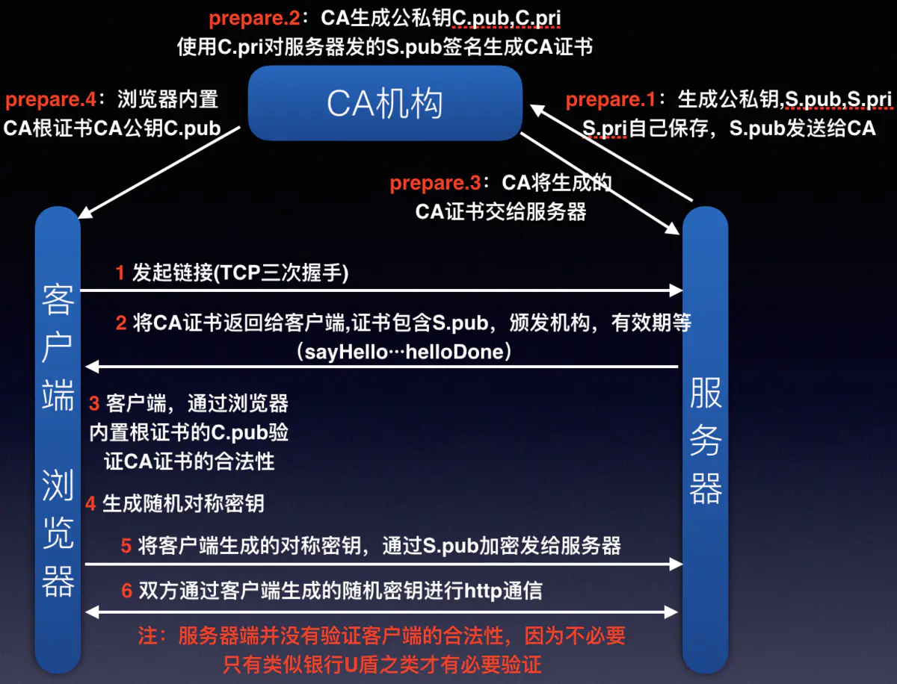

**MT**

#### １. import导入和require导入的区别

- import导入的是值的引用**(原文件发生变化，引用的文件也会发生变化)**

- require导入的值的拷贝**(一旦输出一个值，模块内部的变化就影响不到这个值)**

- AMD依赖前置

  > ```js
  > define(['./package/lib.js'], function(lib) {
  >       function say(){
  >            lib.log('this is fn');
  >        }
  >        return {
  >            say:say
  >        }; 
  > ```
  >
  > 
#### 2. import()引入进行动态加载,可以实现按需加载

- 动态的 import() 提供一个基于 Promise 的 API
- 动态的import() 可以在脚本的任何地方使用
- import() 接受字符串文字，你可以根据你的需要构造说明符

  

### 6. key值必须是唯一的原因

​    注:必须给每一个标签一个唯一的key值(key值必须是唯一的)

```html
<div v-for="(item,index) in items" :key="index"></div>
```

注：**没有key值会按遍历顺序用之前的标签，有些场景不符合逻辑**,

**如果key值存在，文本的就会找到对应的标签**

使用`key`时，它会基于`key`的变化重新排列元素顺序，并且会移除`key`不存在的元素。此外有相同父元素的子元素必须有独特的`key`，重复的`key`会造成渲染错误。

```
key的作用主要是为了高效的更新虚拟DOM
```

 注:key值不会渲染到页面上

​      **如果key值存在,里面的文本改变就不会对标签进行复用**

​      所以尽量不使用index作为key值

​    注:如果仅仅保持标签的位置改变,使用唯一key值,**就会复用标签,从而提高性能;**

   

​    注:key值另外的功能

​       input不写key值,Vue内部会默认进行元素的复用

​       在input输入框中的值都会被保存下来

​       此时我们不希望input标签进行复用,就可以设置唯一key值

​       Vue就会对设置key值的元素不进行元素的复用

**在有了key属性之后，Vue会记住元素们的顺序，并根据这个顺序在适当的位置插入/删除元素来完成更新，这种方法比没有key属性时的就地复用策略效率更高。 总体来说，当使用列表渲染时，永远添加key属性，这样可以提高列表渲染的效率，提高了页面的性能。**


**key值的作用：用于通过旧节点，寻找对应的新节点，如果某个旧节点有key值，则其更新时，会寻找相同层级中的相同key值的节点，进行对比。**

**key值应该在一个范围内唯一（兄弟节点中），并且应该保持稳定**


　### 7. template编译成render的话需要Vue做哪些优化

- 抽象语法树优化：编译器会先检查缓存中是否有已经编译好的结果，如果有结果则直接从缓存中读取。这样做防止每次同样的模板都要进行重复的编译工作。

●首先，通过compile编译器把template编译成AST语法树（abstract syntax tree，即源代码的抽象语法结构的树状表现形式），compile是creatCompiler（createCompiler是用以创建编译器的）的返回值，compile负责合并option

● 然后，AST会经过generate（将AST语法树转化成render function字符串的过程）得到render函数，render的返回值是VNode，VNode是Vue的虚拟DOM节点，里面包含（标签名、子节点、文本等）

### 8. 曝光，图片的预加载


### 9.  localStorage存储空间不足

- 会受到同源策略的约束

**方案**

- 每个子业务划分在不同子域名下，维护自己业务私有的数据
- 移动端可以与客户端通过js bridge 提供一个仿 localStorage 进行数据的维护
- file协议存储，都可以得到
- 跨页面传数据：考虑单页应用、优先采用 url 传数据
- 最后的兜底方案：清掉别人的存储

### 10.  https , http/2.0

　**(1)  状态码**

- 301永久重定向

- 302临时重定向

　**(2) http1.1和http2.0**　　

- 

   **(3) 强制缓存和协商缓存**

   **(4) https**



  https://cloud.tencent.com/developer/article/1662122

  https://segmentfault.com/a/1190000022350860

- **说说WebSocket和HTTP的区别**

- **三次握手，四次挥手**

  在我看来，TCP 三次握手的建立连接的过程就是相互确认初始序号的过程，告诉对方，什么样序号的报文段能够被正确接收。
  第三次握手的作用是客户端对服务器端的初始序号的确认。如果只使用两次握手，那么服务器就没有办法知道自己的序号是否
  已被确认。同时这样也是为了防止失效的请求报文段被服务器接收，而出现错误的情况。

- **如何区分一个数据报是本次连接产生的还是上一次由于网络拥塞延迟到达的**

- **http的下一代要解决什么问题**

### 11. js异步和宏任务

### 12. vue中scoped的实现原理

- **状态传递**
- **路由懒加载原理**
- **单页面路由原理**

PostCSS给一个组件中的所有dom添加了一个独一无二的动态属性，然后，给CSS选择器额外添加一个对应的属性选择器来选择该组件中dom，这种做法使得样式只作用于含有该属性的dom——组件内部dom

### 13 .浏览器原生图片懒加载的方法 "loading" in HTMLImageElement.prototype

  　-  **  开启懒加载**

### 14. 不同长度文字得到一样的宽度怎么用flex实现

### 15 .CDN原理

### 16. eventloop 是什么


### 17. XSS，CSRF攻击以及预防手段

(1)、编码，就是转义用户的输入，把用户的输入解读为数据而不是代码
(2)、校验，对用户的输入及请求都进行过滤检查，如对特殊字符进行过滤，设置输入域的匹配规则等。

### 18.  !documentType 是什么意思

- 严格模式与混杂模式-如何触发这两种模式，区分它们有何意义

### 19. （移动端长列表优化）

### 20 .BigInt

- BigInt
- js垃圾回收机制
- script标签的defer和async的区别？多个标签有 同一属性时顺序是怎样的，能保证有序吗

### 21. react fiber架构的理解

### 22. 时间复杂度

### 23.node主要用来解决什么问题

### 24. docker

​	

### 25.项目监控

​	**oneTrack打点上报**　

　

### 26. css动画

### 27.  cmd/amd/commonjs的差异

### 28. 对于XSS 和CSRF 如何防范

(1)、编码，就是转义用户的输入，把用户的输入解读为数据而不是代码
(2)、校验，对用户的输入及请求都进行过滤检查，如对特殊字符进行过滤，设置输入域的匹配规则等。

**HttpOnly属性的cookie变量无法被js获取**

response.setHeader("Set-Cookie", "cookiename=httponlyTest;Path=/;Domain=domainvalue;Max-Age=seconds;HTTPOnly");

**防御的话为cookie设置httpOnly属性，对用户的输入进行检查，进行特殊字符过滤**


### 3.CSRF

CSRF，即 Cross Site Request Forgery，中译是跨站请求伪造，是一种劫持受信任用户向服务器发送非预期请求的攻击方式。

通常情况下，CSRF 攻击是攻击者借助受害者的 Cookie 骗取服务器的信任，可以在受害者毫不知情的情况下以受害者名义伪造请求发送给受攻击服务器，从而在并未授权的情况下执行在权限保护之下的操作。

**4.1 验证码**

验证码被认为是对抗 CSRF 攻击最简洁而有效的防御方法。

**4.2 Referer Check**

根据 HTTP 协议，在 HTTP 头中有一个字段叫 Referer，它记录了该 HTTP 请求的来源地址。通过 Referer Check，可以检查请求是否来自合法的”源”。

**4.3 添加 token 验证(token==令牌)**


浏览器缓存和服务端的缓存控制

cookie有哪些属性: ***\*Expires/Max-Age\**** 

```html
name　　字段为一个cookie的名称。

value　　字段为一个cookie的值。

domain　　字段为可以访问此cookie的域名。

非顶级域名，如二级域名或者三级域名，设置的cookie的domain只能为顶级域名或者二级域名或者三级域名本身，不能设置其他二级域名的cookie，否则cookie无法生成。

顶级域名只能设置domain为顶级域名，不能设置为二级域名或者三级域名，否则cookie无法生成。

二级域名能读取设置了domain为顶级域名或者自身的cookie，不能读取其他二级域名domain的cookie。所以要想cookie在多个二级域名中共享，需要设置domain为顶级域名，这样就可以在所有二级域名里面或者到这个cookie的值了。
顶级域名只能获取到domain设置为顶级域名的cookie，其他domain设置为二级域名的无法获取。

path　　字段为可以访问此cookie的页面路径。 比如domain是abc.com,path是/test，那么只有/test路径下的页面可以读取此cookie。

expires/Max-Age 　　字段为此cookie超时时间。若设置其值为一个时间，那么当到达此时间后，此cookie失效。不设置的话默认值是Session，意思是cookie会和session一起失效。当浏览器关闭(不是浏览器标签页，而是整个浏览器) 后，此cookie失效。

Size　　字段 此cookie大小。

http　　字段  cookie的httponly属性。若此属性为true，则只有在http请求头中会带有此cookie的信息，而不能通过document.cookie来访问此cookie。

secure　　 字段 设置是否只能通过https来传递此条cookie

```


script defer和async的区别

jsonp

最近的[项目](https://www.nowcoder.com/jump/super-jump/word?word=项目)中有什么是你优化的地方:


***webpack\*** ***如何做性能优化\***: 

询问项目。项目难点以及怎么解决的？项目有哪些亮点？:


## 29. web Worker

为了利用多核CPU的计算能力，HTML5提出Web Worker标准，允许JavaScript脚本创建多个线程，但是子线程完全受主线程控制，且不得操作DOM。所以，这个新标准并没有改变JavaScript单线程的本质。

  10. worker
            js都是单线程的
            worker 是多线程的,是真的多线程,不是伪多线程

          注: worker不能操作dom,没有window对象,不能读取本地文件
                可以发ajax,可以计算
            
           worker多线程的使用
           注:兼容性不太好
           注:主线程和辅线程之间都用postMessage发送消息
           用onmessage接受消息
            
            (1) 开启了一个新的线程
            var work = new Worker('./work.js');
            
            (2) 给work线程传递信息
            work.postMessage(a);
            
            (3)接受work线程传递的消息
            work.onmessage = function(e){
                console.log(e.data);
            }
            
            (4) 在work.js中可以引入其他的js文件
            
            使用importScripts("./math.js")方法引入其他的js文件
            注:引入的js也不能操作DOM
            
            (5) 主线程停止线程
            work.terminate();
            
            (6) work线程(辅助线程)自己停止线程
            this.close();
            
            (7) 在worker中能否继续创建worker ?
            注:在理论上是可以的。但是实际上没有任何一款浏览器是支持的。

```js
     // worker多线程的使用
     // 注:主线程和辅线程之间都用postMessage发送消息
     // 开启了一个新的线程
     var work = new Worker('./work.js');
     // 给work线程传递信息
     work.postMessage(a); 
     // 接受消息
     work.onmessage = function(e){
        console.log(e.data);
     }
	
	 //子线程	
     this.onmessage = function(e){
            console.log(111,this)
            var data = e.data;
            var result = null;
            for(var i = 0 ; i<data ;i++){
                result = result + i;
            }
            // this.close();
            this.postMessage(result);
     }

```

https://www.nowcoder.com/discuss/538616?source_id=discuss_experience_nctrack&channel=-1

## 30.http头部

Content-type

User-Agent

Host

Referer:返回给哪个网址进入该页面

```js
GET http://download.microtool.de:80/somedata.exe
 
Host: download.microtool.de
 
Accept:*/*
 
Pragma: no-cache
 
Cache-Control: no-cache
 
Referer: http://download.microtool.de/
 
User-Agent:Mozilla/4.04[en](Win95;I;Nav)

```

​	


1. 谈谈http1.0 http1.1 http2.0 http3？知道多少说多少

1. 旋转会相对于矩形的那一个点进行旋转，那怎么设置能实现秒针旋转的效果，旋转这块问的很细，直到这块答不出为止，面试官说这块没关系

2. transform: rotate;

3. ### 实现一个可以拖拽的DIV