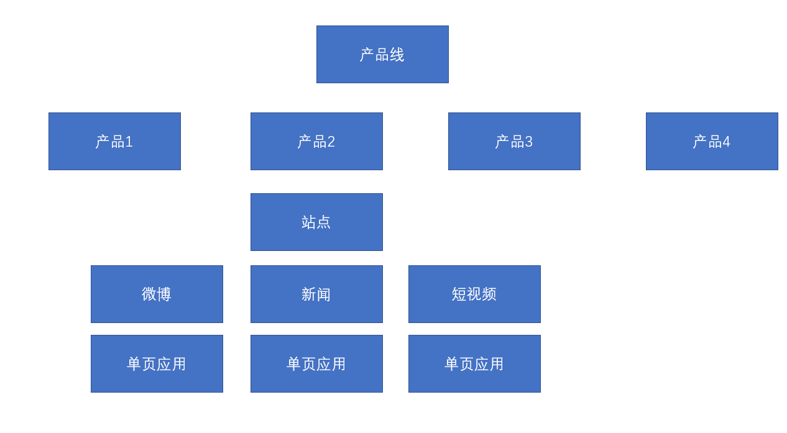

[TOC]

# 一．Lesson1－构建React

## 1. 初识React

### 什么是React？

React是由**Facebook**研发的、用于**解决UI复杂度**的开源**JavaScript库**，目前由React联合社区维护。

> 它不是框架，只是为了解决UI复杂度而诞生的一个库

### React的特点

- 轻量：React的开发版所有源码（包含注释）仅3000多行
- 原生：所有的React的代码都是用原生JS书写而成的，不依赖其他任何库
- 易扩展：React对代码的封装程度较低，也没有过多的使用魔法，所以React中的很多功能都可以扩展。
- 不依赖宿主环境：React只依赖原生JS语言，不依赖任何其他东西，包括运行环境。因此，它可以被轻松的移植到浏览器、桌面应用、移动端。
- 渐近式：React并非框架，对整个工程没有强制约束力。这对与那些已存在的工程，可以逐步的将其改造为React，而不需要全盘重写。
- 单向数据流：所有的数据自顶而下的流动
- 用JS代码声明界面
- 组件化

### 对比Vue

|   对比项   |  Vue  | React |
| :--------: | :---: | :---: |
| 全球使用量 |       |   ✔   |
| 国内使用量 |   ✔   |       |
|    性能    |   ✔   |   ✔   |
|   易上手   |   ✔   |       |
|   灵活度   |       |   ✔   |
|  大型企业  |       |   ✔   |
| 中小型企业 |   ✔   |       |
|    生态    |       |   ✔   |

### 学习路径

整体原则：熟悉API --> 深入理解原理

1. React
   1. 基础：掌握React的基本使用方法，有能力制作各种组件，并理解其基本运作原理
   2. 进阶：掌握React中的一些黑科技，提高代码质量
2. React-Router：相当于vue-router
3. Redux：相当于Vuex
   1. Redux本身
   2. 各种中间件
4. 第三方脚手架：umi
5. UI库：Ant Design，相当于Vue的Element-UI 或 IView
6. 源码部分
   1. React源码分析
   2. Redux源码分析

### react的库

- **react库是react的核心库，用来创建react虚拟对象**
- **react-dom库用以配合核心库进行网页端开发**
- **babel用以将JSX语法解析为JS**


直接在页面上使用React，引用下面的JS

```html
​```crossorigin 用于跨域的时候提示错误
<!--
    引入React的核心库 用来创建React虚拟对象
    不依赖宿主环境(网页),只依赖原生JS语言
-->
<script crossorigin src="https://unpkg.com/react@16/umd/react.development.js"></script>

<!-- 用以将配合核心库进行网页端开发 -->
<script crossorigin src="https://unpkg.com/react-dom@16/umd/react-dom.development.js"></script>

<!-- 将JSX语法解析为JS JS的扩展语法，需要使用babel进行转义 -->
<script src="https://unpkg.com/babel-standalone@6/babel.min.js"></script>
```

### React.createElement

创建一个React元素，称作虚拟DOM，本质上是一个对象

1. 参数1：元素类型，如果是字符串，一个普通的HTML元素
2. 参数2：元素的属性，一个对象
3. 后续参数：元素的子节点
    let h1 = React.createElement('h1',{
        class:'dom'
    },'ssss')
### JSX

JS的扩展语法，需要使用babel进行转义。

## 2. React脚手架

### 1.　使用yarn进行安装 react-learn工程
> (1) yarn create react-app react-learn

### 2.  React脚手架中中index.js怎么被index.html文件引用

> HtmlWebpackPlugin
> 如果你有多个 webpack 入口点， 他们都会在生成的HTML文件中的 script 标签内。
>  https://webpack.docschina.org/plugins/html-webpack-plugin/

### 3. 凡是使用JSX的文件，必须导入React

### 4. 开发环境搭建

> (1) VSCode配置
 - emmet配置：
 -  "javascript": "javascriptreact" //让js支持jsx的语法

> (2) VSCode插件安装


>  -  ESLint：代码风格检查
 -  ES7 React/Redux/GraphQL/React-Native snippets：快速代码编写

> (3) Chrome插件安装
  	> react Developer Tools

### 使用脚手架
- 官方: create-react-app
- 第三方: next.js、umi.js


# 二．Lesson2－React基础

## 1. JSX

### 什么是JSX

- Facebook起草的JS扩展语法
- 本质是一个JS对象，会被babel编译，最终会被转换为React.createElement
- 每个JSX表达式，有且仅有一个根节点
  1. 添加一个空的根节点,不会反应到真实的DOM中,所以不会影响页面结构
  < >
    <div></div>
    <div></div>
  </>
  
  - React.Fragment ===  < ></>
- 每个JSX元素必须结束（XML规范）
  例如 img、input等标签必须要结束(</img></input>)
  或者  这种写法也可以

### 在JSX中嵌入表达式
   <div > 
        {a} * {b}
   </div>

原理:
   React.createElement('div',{},`${a}*${b}`)

- 在JSX中使用注释
- 将表达式作为内容的一部分
  - null、undefined、false不会显示
  - 普通对象，不可以作为子元素 例如obj = {a:1,b:2}就不能作为子元素
  - 可以放置React元素对象
  - 可以放置数组在子元素中,会把数组中每个元素作为子元素加进来 {arr}
- 将表达式作为元素属性 className={name} src={url} style={ { marginLeft:"50px" } }
- 属性使用小驼峰命名法
- 防止注入攻击
  - 自动编码
  - dangerouslySetInnerHTML

### 元素的不可变性 (React元素中的所有属性都不可修改)

- 虽然JSX元素是一个对象，但是该对象中的所有属性不可更改
- 如果确实需要更改元素的属性，需要重新创建JSX元素

## 2. 组件和组件属性

组件：包含内容、样式和功能的UI单元

### 创建一个组件 
--
 function MyComponent() {
     return (
         <h1>我是一个组件</h1>
     )
 }

-- 组件使用
   - 执行函数{MyComponent()}  (很少用)
   - 当成元素来使用 <Mycomponent></MyComponent>

-- 使用组件生成的仍然是一个React元素,变化的只是type值

-- 快速生成组件的快捷键

**特别注意：组件的名称首字母必须大写**


1. 函数组件

返回一个React元素

2. 类组件

必须继承React.Component

必须提供render函数，用于渲染组件
render方法必须返回React元素

-- class Demo extend React.Component {
    render() {
        return (
            <div></div>
        )
    }
}


###  组件的属性

1. 对于函数组件，属性会作为一个对象的属性，传递给函数的参数
2. 对于类组件，属性会作为一个对象的属性，传递给构造函数的参数

注意：组件的属性，应该使用小驼峰命名法

**组件无法改变自身的属性**。

之前学习的React元素，本质上，就是一个组件（内置组件）
- 首字母小写的时候就是一个内置组件(<div></div>)
- 首字母大写的时候就是自定义的函数或者类组件
- 组件的所有属性都不可修改

React中的哲学：数据属于谁，谁才有权力改动

**React中的数据，自顶而下流动**


## 3. 组件状态

组件状态：组件可以自行维护的数据

组件状态仅在类组件中有效

状态（state），本质上是类组件的一个属性，是一个对象

**状态初始化**
  1. - 构造函数中进行状态的初始化

    constructor (props) {
        super(props);
        // 初始化状态
        this.state = {
    
        }
    }
  2. - 在构造函数之外状态初始化 (Es7中提案,在构造函数之外也可以进行私有属性的初始化)
      state = {

   }

**状态的变化**

不能直接改变状态：因为React无法监控到状态发生了变化

必须使用this.setState({})改变状态 //重新设置状态后会触发组件的重新渲染

会将this.setState({

})对象和this.state对象中的值进行混合

- 就是如果新{}有this.state中相同的属性就覆盖之前的值
- 没有就添加新的属性

**一旦调用了this.setState，会导致当前组件重新渲染**

**组件中的数据**

1. props：该数据是由组件的使用者传递的数据，所有权不属于组件自身，因此组件无法改变该数组
2. state：该数据是由组件自身创建的，所有权属于组件自身，因此组件有权改变该数据


## 4. 事件

在React中，组件的事件，本质上就是一个属性

按照之前React对组件的约定，由于事件本质上是一个属性，因此也需要使用小驼峰命名法

**如果没有特殊处理，在事件处理函数中，this指向undefined**

1. 使用bind函数，绑定this
2. 使用箭头函数

- 普通Dom元素绑定事件
    let btn = <button onClick={()=>{
        console.log('点击我')
    }}>点击我</button>

- 组件绑定事件,组件的事件,本质上就是一个属性

```js
    // 如果不使用箭头函数,事件处理函数的this默认值为undefined
    handleOver= () => {
        console.log(222,this)
        this.setState({
            isOver:true,
        })
    }
    demo(){ //这种写法当成属性传递给子组件
            //在子组件中调用他,此时他的this指向为该组件的React元素对象
        console.log('111',this)
    }
```

## 5. 深入认识setState

- setState，它对状态的改变，**可能**是异步的

> **如果改变状态的代码处于某个HTML元素的事件中，则其是异步的，否则是同步**
>
> **setState 在生命周期函数和合成函数中都是异步更新**
>
> **setState 在 setTimeout、原生事件和 async 函数中都是同步更新**

- 如果遇到某个事件中，需要同步调用多次，需要使用函数的方式得到最新状态

- setState第一个参数还可以是函数
  this.setState( cur=>{ //**cur** 表示当前的状态
                        //该函数的返回结果,会混合(覆盖)掉之前的状态
                        //该函数也是异步执行
        return {
            n: cur.n + 1,
        }
  })

> 这种函数式写法,cur的值是值的信任的
> cur就是上一个函数状态改变后传给下一个函数的参数
> 等到前面状态发生改变之后才会运行该函数
  this.setState(cur=>{
      n: cur.n + 1,
  })

> 下面这种写法,无法解决状态多次改变问题
 this.setState({
    n: this.state.n + 1
},()=> { //在状态发生变化之后就会触发该回调函数
         //该回调函数运行在render函数之后
})

**最佳实践：**

1. 把所有的setState当作是异步的
2. 永远不要信任setState调用之后的状态
3. 如果要使用改变之后的状态，需要使用回调函数（setState的第二个参数）
4. 如果新的状态要根据之前的状态进行运算，使用函数的方式改变状态（setState的第一个函数）


React会对异步的setState进行优化，将多次setState进行合并（将多次状态改变完成后，再统一对state进行改变，然后触发render）

## 6. 生命周期

生命周期：组件从诞生到销毁会经历一系列的过程，该过程就叫做生命周期。React在组件的生命周期中提供了一系列的钩子函数（类似于事件），可以让开发者在函数中注入代码，这些代码会在适当的时候运行。

**生命周期仅存在于类组件中，函数组件每次调用都是重新运行函数，旧的组件即刻被销毁**

- 研究的是每个组件实例对象的生命周期

## 旧版生命周期

React < 16.0.0


1. constructor //每个组件的实例对象只会创建一次
   1. 同一个组件对象只会创建一次
   2. 不能在第一次挂载到页面之前，调用setState，为了避免问题，构造函数中严禁使用setState
2. componentWillMount
   1. 正常情况下，和构造函数一样，它只会运行一次
   2. 可以使用setState，但是为了避免bug，不允许使用，因为在某些特殊情况下，该函数可能被调用多次
3. **render**
   1. 返回一个虚拟DOM，会被挂载到虚拟DOM树中，最终渲染到页面的真实DOM中
   2. render可能不只运行一次，只要需要重新渲染，就会重新运行
   3. 严禁使用setState，因为可能会导致无限递归渲染
4. **componentDidMount**
   1. 只会执行一次
   2. 可以使用setState
   3. 通常情况下，会将网络请求、启动计时器等一开始需要的操作，书写到该函数中
5. 组件进入活跃状态
6. componentWillReceiveProps
   1. 即将接收新的属性值
   2. 参数为新的属性对象
   3. 该函数可能会导致一些bug，所以不推荐使用
7. **shouldComponentUpdate**
   1. 指示React是否要重新渲染该组件，通过返回true和false来指定
   2. 默认情况下，会直接返回true
8. componentWillUpdate
   1. 组件即将被重新渲染
9. componentDidUpdate
   1.  往往在该函数中使用dom操作，改变元素
10. **componentWillUnmount**
    1.  通常在该函数中销毁一些组件依赖的资源，比如计时器

## 新版生命周期

React >= 16.0.0

React官方认为，某个数据的来源必须是单一的


1. getDerivedStateFromProps
   1. 通过参数可以获取新的属性和状态
   2. 该函数是静态的
   3. 该函数的返回值会覆盖掉组件状态
   4. 该函数几乎是没有什么用
2. getSnapshotBeforeUpdate
   1. 真实的DOM构建完成，但还未实际渲染到页面中。
   2. 在该函数中，通常用于实现一些附加的dom操作
   3. 该函数的返回值，会作为componentDidUpdate的第三个参数

## 7.  传递元素内容给子组件

**如果给自定义组件传递元素内容，则React会将元素内容作为children属性传递过去**
内置组件：div、h1、p

```html
<div>
　 wthe
</div>
```

- <Comp html={}></Comp> 这种写法

===
```jsx
<Comp> //会在子组件属性props中创建children来存储h1的react对象
    <h1>122</h1>
</Comp>
```
## ８.  表单

**受控组件和非受控组件**

受控组件：组件的使用者，有能力完全控制该组件的行为和内容。通常情况下，受控组件往往没有自身的状态，其内容完全收到属性的控制。

非受控组件：组件的使用者，没有能力控制该组件的行为和内容，组件的行为和内容完全自行控-- 制。
-  **想要变为受控组件,需要使用onChange函数改变value值**

**表单组件，默认情况下是非受控组件，一旦设置了表单组件的value属性，则其变为受控组件**
**(单选和多选框需要设置checked)**

<input type='text' value=123 /> 

- 如果设置value的值,则其为受控组件,此时input中的值为只读的值

<input type='text' defaultValue=123 /> 
- 此时input中的值仅为默认值,可以进行更改,此时它又变为非受控组件

> 想要变为受控组件,需要使用onChange函数改变value值

<input type='text' value={this.state.val} onChange={()=>{
    this.setState({//通过改变状态,使组件重新渲染,从而改变input值

    })
}}>


# 三．Lesson３－React进阶

## 1. 默认属性和类型检查

### (1)  属性默认值

通过一个静态属性```defaultProps```告知react属性默认值

- 函数静态属性
   Func.defaultProps = {
      a:1,
      b:2
   }
- 类的静态属性
  static defaultProps = {
      a:1,
      b:2
  }


### (2) 属性类型检查

**使用库**：```prop-types```

对组件使用静态属性```propTypes```告知react如何检查属性

static propTypes = {
   a:PropTypes.number.isRequired, **代表a属性是必填的并且必须是数字类型**
}

> 
## 先进行属性混合,再进行属性类型检查

```js
PropTypes.any：//任意类型
PropTypes.array：//数组类型
PropTypes.bool：//布尔类型
PropTypes.func：//函数类型
PropTypes.number：//数字类型
PropTypes.object：//对象类型
PropTypes.string：//字符串类型
PropTypes.symbol：//符号类型

PropTypes.node：//任何可以被渲染的内容，字符串、数字、React元素 <Comp />
PropTypes.element：//react元素  <Comp />
PropTypes.elementType：//react元素类型   {Comp}
PropTypes.instanceOf(构造函数)：//必须是指定构造函数的实例
PropTypes.oneOf([xxx, xxx])：//枚举
PropTypes.oneOfType([xxx, xxx]);  //属性类型必须是数组中的其中一个
PropTypes.arrayOf(PropTypes.XXX)：//必须是某一类型组成的数组,可以传递一个空数组
PropTypes.objectOf(PropTypes.XXX)：//对象由某一类型的值组成
PropTypes.shape(对象): //属性必须是对象，并且满足指定的对象要求
PropTypes.exact({...})：//对象必须精确匹配传递的数据

//自定义属性检查，如果有错误，返回错误对象即可
属性: function(props, propName, componentName) {
   //...
}

propTypes.number.isRequired //代表该属性为必填的
```

## 2. HOC － 高阶组件

HOF：Higher-Order Function, 高阶函数，以函数作为参数，并返回一个函数
HOC: Higher-Order Component, 高阶组件，以组件作为参数，并返回一个组件

通常，可以利用HOC实现横切关注点。

> 举例：20个组件，每个组件在创建组件和销毁组件时，需要作日志记录
> 20个组件，它们需要显示一些内容，得到的数据结构完全一致

```js
    export default function (comp) {
        return class withTest extends React.Component {

        }
    }
    
    export default function withLogin(Comp) {
       return function loginWrapper(props) {
            if(props.login) {
                return <Comp {...props}></Comp>
            }else{
                return null;
            }
       }
    }

```

**注意**

1. 不要在render中使用高阶组件 let comp = withTest(A); 
**定义组件不能写在render函数和函数组件中,因为每次组件重新渲染都会重新创建新的实例,影响性能**
2. 不要在高阶组件内部更改传入的组件 
**可能导致传入组件内部的功能被修改,使组件书写起来压力很大**

## ３. ref －使用自定义组件中的某个方法

reference: 引用

场景：希望直接使用dom元素中的某个方法，或者希望直接使用自定义组件中的某个方法

1. ref作用于内置的html组件，得到的将是真实的dom对象<input type='text' ref='oinp'>
2. ref作用于类组件，得到的将是类的实例<Comp ref='Comp' />
3. ref不能作用于函数组件

ref不再推荐使用字符串赋值，字符串赋值的方式将来可能会被移出

目前，ref推荐使用对象或者是函数

**对象**

- 通过 React.createRef 函数创建
- 也可以直接
  this.txt = {
       current:null,
   }
> 在执行render函数的时候给对象重新赋值 
> <input type='text' ref={this.txt}>

- this.txt.current 得到Dom元素

**函数**

- <input type='text' ref={(el)=>{
   this.txt = el;
   }}>

- this.txt 得到Dom元素


函数的调用时间：

1. componentDidMount的时候会调用该函数
   1. 在componentDidMount事件中可以使用ref
2. 如果ref的值发生了变动（旧的函数被新的函数替代），分别调用旧的函数以及新的函数，时间点出现在componentDidUpdate之前
   1. 旧的函数被调用时，传递null
   2. 新的函数被调用时，传递对象
3. 如果ref所在的组件被卸载，会调用函数

**谨慎使用ref**

能够使用属性和状态进行控制，就不要使用ref。

1. 调用真实的DOM对象中的方法
2. 某个时候需要调用类组件的方法

## 4. Ref转发

forwardRef

forwardRef方法：

**此时通过调用this.ref就可以得到函数组件中的h1元素**
- 从而实现Ref转发

- 此时ref会被当做参数传给函数组件
- 会被当做函数组件的第二个参数
- 不会像之前的ref一样得到Dom对象或者类组件对象
- 然后可以在函数组件中自行处理

````js

let NewA = React.forwardRef(A); //参数必须是函数组件

<NewA ref={this.ref} />


function A (props,ref){
    return (
        <h1 ref={ref} />
    )
}


````

1. 参数，传递的是函数组件，不能是类组件，并且，函数组件需要有第二个参数来得到ref
2. 返回值，返回一个新的组件

## 5. Context － 上下文

上下文：Context，表示做某一些事情的环境

React中的上下文特点：

1. 当某个组件创建了上下文后，上下文中的数据，会被所有后代组件共享
2. 如果某个组件依赖了上下文，会导致该组件不再纯粹（外部数据仅来源于属性props）
3. 一般情况下，用于第三方组件（通用组件）

## 旧的API  <16

**创建上下文**

- 只有类组件才可以创建上下文

1. 给类组件书写静态属性 childContextTypes，使用该属性对上下文中的数据类型进行约束
**(类似于propTypes)**
2. 添加实例方法 getChildContext，该方法返回的对象，即为上下文中的数据，该数据必须满足类型约束，该方法会在每次render之后运行。（属性或者状态发生变化都会重新执行该函数）

**使用上下文中的数据**

要求：如果要使用上下文中的数据，组件必须有一个静态属性 contextTypes，该属性描述了需要获取的上下文中的数据类型

1. 可以在组件的构造函数中，通过第二个参数，获取上下文数据
2. **从类组件的context属性中获取**
3. 在函数组件中，通过第二个参数，获取上下文数据
4. 如果子组件上级组件有多个上下文,会类似于js中作用域链进行逐级查找
   会先查找离自己最近的上下文

**上下文的数据变化**

上下文中的数据不可以直接变化，最终都是通过状态改变

在上下文中加入一个处理函数，可以用于后代组件更改上下文的数据

## 新版API

旧版API存在严重的效率问题，并且容易导致滥用

**创建上下文**

上下文是一个独立于组件的对象，该对象通过React.createContext(默认值)创建
**注:只有当组件所处的树中没有匹配到 Provider 时，其 defaultValue(默认值)参数才会生效**

返回的是一个包含两个属性的对象

1. Provider属性：生产者。一个组件，该组件会创建一个上下文，该组件有一个value属性，通过该属性，可以为其数据赋值
   1. 同一个Provider，不要用到多个组件中，如果需要在其他组件中使用该数据，应该考虑将数据提升到更高的层次
   2. 只有放在Provider组件内部渲染的子元素才可以使用Provider创建的上下文数据

2. Consumer属性：后续讲解

**使用上下文中的数据**

1. 在类组件中，直接使用this.context获取上下文数据
   1. 要求：必须拥有静态属性 contextType , 应赋值为创建的上下文对象
   2. 在类组件中也可以使用ctx.Consumer来得到上下文数据
   3. this.context只能用一个上下文数据,不能解决同时用多个上下文数据的问题

2. 在函数组件中，需要使用Consumer来获取上下文数据
   1. Consumer是一个组件
   2. 它的子节点，是一个函数（它的props.children需要传递一个函数）
   3. 函数组件中不需要设置静态属性
   4. 会将Consumer组件中函数的返回结果进行渲染


**注意细节**

如果，上下文提供者（Context.Provider）中的value属性发生变化(Object.is比较)，会导致该上下文提供的所有后代元素全部重新渲染，无论该子元素是否有优化（无论shouldComponentUpdate函数返回什么结果）
(因为上下文属性发生变化的时候,直接就不执行shouldComponentUpdate这个函数)
(所以shouldComponentUpdate函数的返回结果不没有任何意义)


## 6. Context － 上下文应用场景

上下文的应用场景

编写一套组件（有多个组件），这些组件之间需要相互配合才能最终完成功能

比如，我们要开发一套表单组件，使用方式如下

- 如果是react的内置组件(Dom元素组件)
- 也存在通过childern传递属性,但是直接正常渲染

- 如果是自定义组件内部传递子元素
- 可能会在自定义组件内部使用children属性来调用子元素

```js

render(){
return (
<Form onSubmit={datas=>{
　　console.log(datas); //获取表单中的所有数据（对象）
/*
{
loginId:xxxx,
loginPwd:xxxx
}
*/
}}>
    <div>
      账号： <Form.Input name="loginId" />
    </div>
    <div>
    密码： <Form.Input name="loginPwd" type="password" />
    </div>
    <div>
　　　　<Form.Button>提交</Form.Button>
    </div>
</Form>
);
}
```

## 7. PureComponent － 纯组件

纯组件,用于避免不必要的渲染(运行render函数),从而提高效率

优化:如果一个组件的属性和状态,都没有发生变化,重新渲染该组件是没有必要的

PureComponent是一个组件,如果某个组件继承自该组价,
则该组件shouldComponentUpdate会进行优化,对属性和状态进行浅比较
如果相等则不会重新渲染

**注意**

1. PureComponent进行的是浅比较
    1. 为了效率,应该尽量使用PureComponent
    2. 要求不要改变之前的状态,永远是创建新的状态覆盖之前的状态(Immutable,不可变对象)
    3. 有一个第三方库,Immutable.js,它专门用于制作不可变对象

2. 函数组件,使用React.memo函数制作纯组件
-  它是一个高级组件(传递一个函数作为参数),返回的值即为一个纯组件

   let PureFunc = React.memo(Task);
## 8.render props(传递属性给子组件)

有时候，某些组件的各种功能及其处理逻辑几乎完全相同，只是显示的界面不一样，建议下面的方式认选其一来解决重复代码的问题（横切关注点）

1. render props
   1. 某个组件，需要某个属性
   2. 该属性是一个函数，函数的返回值用于渲染
   3. 函数的参数会传递为需要的数据
   4. 注意纯组件的属性（尽量避免每次传递的render props的地址不一致）
   5. 通常该属性的名字叫做render
2. HOC  (高阶组件)

## 9.Portals

插槽：将一个React元素渲染到指定的DOM容器中

ReactDOM.createPortal(React元素, 真实的DOM容器)，该函数返回一个React元素

**注意事件冒泡**

1. React中的事件是包装过的
2. 它的事件冒泡是根据虚拟DOM树来冒泡的，与真实的DOM树无关。

## 10.错误边界

默认情况下，若一个组件在**渲染期间**（render）发生错误，会导致整个组件树全部被卸载

错误边界：是一个组件，该组件会捕获到渲染期间（render）子组件发生的错误，并有能力阻止错误继续传播

**让某个组件捕获错误**

1. 编写生命周期函数 getDerivedStateFromError
   1. 静态函数
   2. 运行时间点：渲染子组件的过程中，发生错误之后，在更新页面之前
   3. **注意：只有子组件发生错误，才会运行该函数** ```组件自身发生错误他是不会运行该函数的``` 
   4. 该函数返回一个对象，React会将该对象的属性覆盖掉当前组件的state
   5. 参数：错误对象
   6. 通常，该函数用于改变状态
2. 编写生命周期函数 componentDidCatch
   1. 实例方法
   2. 运行时间点：渲染子组件的过程中，发生错误，更新页面之后，由于其运行时间点比较靠后，因此不太会在该函数中改变状态
   3. 通常，该函数用于记录错误消息


**细节**

某些错误，错误边界组件无法捕获

1. 自身的错误
2. 异步的错误   (解决异步的错误需要使用try-catch方法来控制页面显示)
3. 事件中的错误 (解决事件的错误需要使用try-catch方法来控制页面显示)

总结：仅处理渲染子组件期间的同步错误
 try{

 }catch(){

 }
## 11.React中的事件

这里的事件：React内置的DOM组件中的事件

- 注: react给内置组件绑定事件均在document中绑定```
- 所以的事件都是通过冒泡到document中进行绑定,如果在冒泡到document之前阻止冒泡
- 就会导致react中绑定的事件失效
- document是通过一个队列进行一系列事件的绑定
- 如何区分触发的是哪个元素的哪个事件,react应该有一套类似于e.target的校验规则


1. 给document注册事件
2. 几乎所有的元素的事件处理，均在document的事件中处理
   1. 一些不冒泡的事件，是直接在元素上监听
   2. 一些document上面没有的事件，直接在元素上监听
3. 在document的事件处理，React会根据虚拟DOM树的完成事件函数的调用
4. React的事件参数，并非真实的DOM事件参数，是React合成的一个对象，该对象类似于真实DOM的事件参数
   1. stopPropagation，阻止事件在虚拟DOM树中冒泡
   2. nativeEvent，可以得到真实的DOM事件对象
   3. 为了提高执行效率，React使用事件对象池来处理事件对象


**注意事项**

1. 如果给真实的DOM注册事件，阻止了事件冒泡，则会导致react的相应事件无法触发
2. 如果给真实的DOM注册事件，事件会先于React事件运行
3. 通过React的事件中阻止事件冒泡，无法阻止真实的DOM事件冒泡
4. 可以通过nativeEvent.stopImmediatePropagation()，阻止document上剩余事件的执行
5. 在事件处理程序中，不要异步的使用事件对象，如果一定要使用，需要调用persist函数

## 12.渲染原理

渲染：生成用于显示的对象，以及将这些对象形成真实的DOM对象

- React元素：React Element，通过React.createElement创建（语法糖：JSX）
  - 例如：
  - ```<div><h1>标题</h1></div>```
  - ```<App />```
- React节点：专门用于渲染到UI界面的对象，React会通过React元素，创建React节点，ReactDOM一定是通过React节点来进行渲染的
- 节点类型：
  - React DOM节点：创建该节点的React元素类型是一个字符串
  - React 组件节点：创建该节点的React元素类型是一个函数或是一个类
  - React 文本节点：由字符串、数字创建的
  - React 空节点：由null、undefined、false、true
  - React 数组节点：该节点由一个数组创建
- 真实DOM：通过document.createElement创建的dom元素


## 首次渲染(新节点渲染)

1. 通过参数的值创建节点
2. 根据不同的节点，做不同的事情
   1. 文本节点：通过document.createTextNode创建真实的文本节点
   2. 空节点：什么都不做
   3. 数组节点：遍历数组，将数组每一项递归创建节点（回到第1步进行反复操作，直到遍历结束）
   4. DOM节点：通过document.createElement创建真实的DOM对象，然后立即设置该真实DOM元素的各种属性，然后遍历对应React元素的children属性，递归操作（回到第1步进行反复操作，直到遍历结束）
   5. 组件节点
      1. 函数组件：调用函数(该函数必须返回一个可以生成节点的内容)，将该函数的返回结果递归生成节点（回到第1步进行反复操作，直到遍历结束）
      2. 类组件：
         1. 创建该类的实例
         2. 立即调用对象的生命周期方法：static getDerivedStateFromProps
         3. 运行该对象的render方法，拿到节点对象（将该节点递归操作，回到第1步进行反复操作）
         4. 将该组件的componentDidMount加入到执行队列（先进先出，先进先执行），当整个虚拟DOM树全部构建完毕，并且将真实的DOM对象加入到容器中后，执行该队列
3. 生成出虚拟DOM树之后，将该树保存起来，以便后续使用
4. 将之前生成的真实的DOM对象，加入到容器中。

```js
const app = <div className="assaf">
    <h1>
        标题
        {["abc", null, <p>段落</p>]}
    </h1>
    <p>
        {undefined}
    </p>
</div>;
ReactDOM.render(app, document.getElementById('root'));
```

以上代码生成的虚拟DOM树：


```js

function Comp1(props) {
    return <h1>Comp1 {props.n}</h1>
}

function App(props) {
    return (
        <div>
            <Comp1 n={5} />
        </div>
    )
}

const app = <App />;
ReactDOM.render(app, document.getElementById('root'));
```

以上代码生成的虚拟DOM树：


```js
class Comp1 extends React.Component {
    render() {
        return (
            <h1>Comp1</h1>
        )
    }
}

class App extends React.Component {
    render() {
        return (
            <div>
                <Comp1 />
            </div>
        )
    }
}

const app = <App />;
ReactDOM.render(app, document.getElementById('root'));
```

以上代码生成的虚拟DOM树：


## 更新节点

更新的场景：

1. 重新调用ReactDOM.render，触发根节点更新
2. 在类组件的实例对象中调用setState，会导致该实例所在的节点更新

**节点的更新**

- 如果调用的是ReactDOM.render，进入根节点的**对比（diff）更新**
- 如果调用的是setState
  - 1. 运行生命周期函数，static getDerivedStateFromProps
  - 2. 运行shouldComponentUpdate，如果该函数返回false，终止当前流程 
  - 3. 运行render，得到一个新的节点，进入该新的节点的**对比更新**
  - 4. 将生命周期函数getSnapshotBeforeUpdate加入执行队列，以待将来执行
  - 5. 将生命周期函数componentDidUpdate加入执行队列，以待将来执行

后续步骤：
1. 更新虚拟DOM树
2. 完成真实的DOM更新
3. 依次调用执行队列中的componentDidMount
4. 依次调用执行队列中的getSnapshotBeforegUpdate
5. 依次调用执行队列中的componentDidUpdate


### 对比更新

将新产生的节点，对比之前虚拟DOM中的节点，发现差异，完成更新

问题：对比之前DOM树中哪个节点

React为了提高对比效率，做出以下假设

1. 假设节点不会出现层次的移动（对比时，直接找到旧树中对应位置的节点进行对比）
2. 不同的节点类型会生成不同的结构
   1. 相同的节点类型：节点本身类型相同，如果是由React元素生成，type值还必须一致
   2. 其他的，都属于不相同的节点类型
3. 多个兄弟通过唯一标识（key）来确定对比的新节点

key值的作用：用于通过旧节点，寻找对应的新节点，如果某个旧节点有key值，则其更新时，会寻找相同层级中的相同key值的节点，进行对比。

**key值应该在一个范围内唯一（兄弟节点中），并且应该保持稳定**

#### 找到了对比的目标

判断节点类型是否一致


- **一致**

根据不同的节点类型，做不同的事情

**空节点**：不做任何事情

**DOM节点**：
1. 直接重用之前的真实DOM对象
2. 将其属性的变化记录下来，以待将来统一完成更新（现在不会真正的变化）
3. 遍历该新的React元素的子元素，**递归对比更新**


**文本节点**：
1. 直接重用之前的真实DOM对象
2. 将新的文本变化记录下来，将来统一完成更新

**组件节点**：

**函数组件**：重新调用函数，得到一个节点对象，进入**递归对比更新**

**类组件**：

1. 重用之前的实例
2. 调用生命周期方法getDerivedStateFromProps
3. 调用生命周期方法shouldComponentUpdate，若该方法返回false，终止
4. 运行render，得到新的节点对象，进入**递归对比更新**
5. 将该对象的getSnapshotBeforeUpdate加入队列
6. 将该对象的componentDidUpdate加入队列

**数组节点**：遍历数组进行**递归对比更新**

- **不一致**

整体上，卸载旧的节点，全新创建新的节点

**创建新节点**

进入新节点的挂载流程

**卸载旧节点**

1. **文本节点、DOM节点、数组节点、空节点、函数组件节点**：直接放弃该节点，如果节点有子节点，递归卸载节点
2. **类组件节点**：
   1. 直接放弃该节点
   2. 调用该节点的componentWillUnMount函数
   3. 递归卸载子节点


#### 没有找到对比的目标

新的DOM树中有节点被删除

新的DOM树中有节点添加

- 创建新加入的节点
- 卸载多余的旧节点

## 13.工具

## 严格模式

StrictMode(```React.StrictMode```)，本质是一个组件，该组件不进行UI渲染（```React.Fragment <> </>```），它的作用是，在渲染内部组件时，发现不合适的代码。

- 识别不安全的生命周期
- 关于使用过时字符串 ref API 的警告
- 关于使用废弃的 findDOMNode 方法的警告
- 检测意外的副作用
  - React要求，副作用代码仅出现在以下生命周期函数中
  - 1. ComponentDidMount
  - 2. ComponentDidUpdate
  - 3. ComponentWillUnMount

副作用：一个函数中，做了一些会影响函数外部数据的事情，例如：

1. 异步处理
2. 改变参数值
3. setState
4. 本地存储
5. 改变函数外部的变量

相反的，如果一个函数没有副作用，则可以认为该函数是一个纯函数

在严格模式下，虽然不能监控到具体的副作用代码，但它会将不能具有副作用的函数调用两遍，以便发现问题。（这种情况，仅在开发模式下有效）

- 检测过时的 context API

## Profiler

性能分析工具

分析某一次或多次提交（更新），涉及到的组件的渲染时间

火焰图：得到某一次提交，每个组件总的渲染时间以及自身的渲染时间

排序图：得到某一次提交，每个组件自身渲染时间的排序

组件图：某一个组件，在多次提交中，自身渲染花费的时间

# 四．Lesson4－ Hook

## 1. HOOK简介

HOOK是React16.8.0之后出现

组件：无状态组件（函数组件）、类组件

类组件中的麻烦：

1. this指向问题

2. 繁琐的生命周期

3. 其他问题


HOOK专门用于增强函数组件的功能（HOOK在类组件中是不能使用的），使之理论上可以成为类组件的替代品

官方强调：没有必要更改已经完成的类组件，官方目前没有计划取消类组件，只是鼓励使用函数组件

HOOK（钩子）本质上是一个函数(命名上总是以use开头)，该函数可以挂载任何功能

HOOK种类：

1. useState
2. useEffect
3. 其他...

## 2.State Hook

State Hook是一个在函数组件中使用的函数（useState），用于在函数组件中使用状态

useState

- 函数有一个参数，这个参数的值表示状态的默认值(不传递参数,默认值为undefined)
- 函数的返回值是一个数组，该数组一定包含两项
  - 第一项：当前状态的值
  - 第二项：改变状态的函数

一个函数组件中可以有**多个状态**，这种做法非常有利于横向切分关注点。

- 状态表格


## userState原理
```注:每个节点都会附着自己的状态表格 ```
```   所以同一个函数组件状态互不干扰 ```
1. 第1次调用userState
2. 检查该节点的状态表格是否存在下标0
3. 不存在
     1. 使用默认值创建一个状态  
     2. 将该状态加入到状态表格中 index:0  state:0
4. 重新渲染时
   如果存在对应的下标
     1. 忽略掉默认值
     2. 直接得到状态值

1. 第2次调用userState
2. 检查该节点的状态表格是否存在下标1
3. 不存在
     1. 使用默认值创建一个状态  
     2. 将该状态加入到状态表格中 
        index:0  state:0
        index:1  state:true


**注意的细节**

1. useState最好写到函数的起始位置，便于阅读
2. useState严禁出现在代码块（判断、循环）中
3. useState返回的函数（数组的第二项），引用不变（节约内存空间）
4. 使用函数改变数据，若数据和之前的数据完全相等（使用Object.is比较），不会导致重新渲染，以达到优化效率的目的。
5. 使用函数改变数据，传入的值不会和原来的数据进行合并，而是直接替换。
6. 如果要实现强制刷新组件
   1. 类组件：使用forceUpdate函数,强制让组件运行render(不会运行shouldComponentUpdate)
             强制重新渲染
   2. 函数组件：使用一个空对象的useState
7. **如果某些状态之间没有必然的联系，应该分化为不同的状态，而不要合并成一个对象**
8. 和类组件的状态一样，函数组件中改变状态可能是异步的（在DOM事件中），多个状态变化会合并以提高效率，此时，不能信任之前的状态，而应该使用回调函数的方式改变状态。如果状态变化要使用到之前的状态，尽量传递函数。

  setState( n=>{
       return n + 1;
  })
   setState( n=>{ **此时n为上面的n+1**
       return n + 1;
  })

## 3.Effect Hook

Effect Hook：用于在函数组件中处理副作用

副作用：

1. ajax请求
2. 计时器
3. 其他异步操作
4. 更改真实DOM对象
5. 本地存储
6. 其他会对外部产生影响的操作

函数：useEffect，该函数接收一个函数作为参数，接收的函数就是需要进行副作用操作的函数


**细节**

1. 副作用函数的运行时间点，是在页面完成真实的UI渲染之后。因此它的执行是异步的，并且不会阻塞浏览器
   1. 与类组件中componentDidMount和componentDidUpdate的区别
   2. componentDidMount和componentDidUpdate，更改了真实DOM，但是用户还没有看到UI更新，同步的。
   3. useEffect中的副作用函数，更改了真实DOM，并且用户已经看到了UI更新，异步的。
2. 每个函数组件中，可以多次使用useEffect，**但不要放入判断或循环等代码块中。**
3. useEffect中的副作用函数，可以有返回值，返回值必须是一个函数，该函数叫做清理函数
   1. 该函数运行时间点，在每次运行副作用函数之前
   2. 首次渲染组件不会运行
   3. 组件被销毁时一定会运行
4. useEffect函数，可以传递第二个参数
   1. 第二个参数是一个数组
   2. 数组中记录该副作用的依赖数据
   3. 当组件重新渲染后，只有依赖数据与上一次不一样的时，才会执行副作用
   4. 所以，当传递了依赖数据之后，如果数据没有发生变化
      1. 副作用函数仅在第一次渲染后运行
      2. 清理函数仅在卸载组件后运行
   5. 使用空数组作为依赖项,则副作用函数仅在挂载的时候运行

**注**:可变值不是有效的依赖项，因为对它们进行变异不会重新呈现组件
       如果依赖项值的改变,不会重新渲染组件,就不要作为依赖项
- 例如: useRef()值的改变就不会重新渲染组件

5. 副作用函数中，如果使用了函数上下文中的变量，则由于闭包的影响，会导致副作用函数中变量不会实时变化。

6. 副作用函数在每次注册时，会覆盖掉之前的副作用函数，因此，尽量保持副作用函数稳定，否则控制起来会比较复杂。

   ```js
   //这种写法在副作用函数中会形成闭包，此时副作用函数中拿到的n一直是首次执行得到的n:10
   //所以计时器执行得到的结果都是9
   const [n, setN] = useState(10)
       useEffect(() => {
           //仅挂载后运行
           const timer = setInterval(() => {
               const newN = n - 1;
               console.log(newN)
               setN(newN);
               if (newN === 0) {
                   clearInterval(timer);
               }
           }, 1000)
           return () => { //函数卸载时运行
               clearInterval(timer);
           }
       }, [])
   ```

   


## 4.自定义Hook

State Hook： useState
Effect Hook：useEffect

自定义Hook：将一些常用的、跨越多个组件的Hook功能，抽离出去形成一个函数，该函数就是自定义Hook，自定义Hook，由于其内部需要使用Hook功能，所以它本身也需要按照Hook的规则实现：

1. 函数名必须以use开头
2. 调用自定义Hook函数时，应该放到顶层

例如：

1. 很多组件都需要在第一次加载完成后，获取所有学生数据
2. 很多组件都需要在第一次加载完成后，启动一个计时器，然后在组件销毁时卸载

> 使用Hook的时候，如果没有严格按照Hook的规则进行，eslint的一个插件（eslint-plugin-react-hooks）会报出警告

## 5.Reducer Hook

Flux：Facebook出品的一个数据流框架

1. 规定了数据是单向流动的
2. 数据存储在数据仓库中（目前，可以认为state就是一个存储数据的仓库）
3. action是改变数据的唯一原因（本质上就是一个对象，action有两个属性）
   1. type：字符串，动作的类型
   2. payload：任意类型，动作发生后的附加信息
   3. 例如，如果是添加一个学生，action可以描述为：
      1. ```{ type:"addStudent", payload: {学生对象的各种信息} }```
   4. 例如，如果要删除一个学生，action可以描述为：
      1. ```{ type:"deleteStudent", payload: 学生id }```
4. 具体改变数据的是一个函数，该函数叫做reducer
   1. 该函数接收两个参数
      1. state：表示当前数据仓库中的数据
      2. action：描述了如何去改变数据，以及改变数据的一些附加信息
   2. 该函数必须有一个返回结果，用于表示数据仓库变化之后的数据
      1. Flux要求，对象是不可变的，如果返回对象，必须创建新的对象
   3. reducer必须是纯函数，不能有任何副作用
5. 如果要触发reducer，不可以直接调用，而是应该调用一个辅助函数dispatch
   1. 该函数仅接收一个参数：action
   2. 该函数会间接去调用reducer，以达到改变数据的目的

## 6.Context Hook

用于获取上下文数据
```js
 const context = useContext(ctx);
```

## 7.Callback Hook

函数名：useCallback

用于得到一个固定引用值的函数，通常用它进行性能优化

> 因为在函数组件中,每次传递一个箭头函数给子组件
> 如果因为别的状态的改变,会导致传递箭头函数的那个子组件一直渲染
> 因为每次箭头函数的地址都是一个新的地址
> 所以需要一个方法来存放函数的地址,从而实现组件优化
> Callback就可以实现

useCallback:

该函数有两个参数：

1. 函数，useCallback会固定该函数的引用，只要依赖项没有发生变化，则始终返回之前函数的地址
2. 数组，记录依赖项

该函数返回：引用相对固定的函数地址

## 8.Memo Hook

用于保持一些比较稳定的数据，通常用于性能优化

**如果React元素本身的引用没有发生变化，一定不会重新渲染**

**注:**
- let Comp =  <Demo/>;
- 虽然创建了Demo组件,但是没渲染该组件
- 就不会执行Demo组件所在的函数 
- 渲染组件的时候才会运行函数

```js

/*
    第一次渲染的时候,就会执行useMemo()中第一个参数中的函数
    将该函数的返回结果作为useMemo()自己的返回结果
    赋值给handClick
    再次重新渲染的时候
    如果后面数组的依赖项没有发生变化
    就不会再执行第一个参数的函数
    而是直接使用上次返回的函数
    
*/
let handClick = useMemo(()=>{
                    return ()=>{
                        setTxt(txt + 1);
                    }
                },[txt])


```
## 9.Ref Hook

useRef函数：

1. 一个参数：默认值
2. 返回一个固定的对象，```{current: 值}```
3. useRef的值改变不会使组件重新渲染

**注**:useRef()的值不是有效的依赖项，因为对它们进行变异不会重新呈现组件
       如果依赖项值的改变,不会重新渲染组件,就不要作为依赖项
- 例如: useRef()值的改变就不会重新渲染组件


## 10.ImperativeHandle Hook

函数：useImperativeHandleHook

```js
useImperativeHandle(ref,()=>{
    return {
        methods:()=>{

        }
    }
},[])
```
- 返回值会存储在ref.current对象中
- 可以在父级通过ref.current.methods()进行调用
- 该函数也有依赖项
- 如果没有依赖项,每次允许函数组件都会调用该方法
- 使用[]，则第一次进行调用后,会进行缓存,只有依赖项发生变化时才会重新调用函数

## 11.LayoutEffect Hook

useEffect:浏览器渲染完成后,用户看到新的渲染结果之后执行
useLayoutEffect:在渲染页面之前执行该函数,相当于componentDidMount
                完成了Dom改动,但还没有呈现给用户
用法 === useEffect

> 主要用来操作真实Dom的改变

**注:应该尽量使用useEffect,因为它不会导致渲染阻塞**
**如果出现了问题,再考虑使用useLayoutEffectHook**

## 12.DebugValue Hook

useDebugValue:用于将自定义Hook的关联数据显示到调试栏

- 如果创建的自定义Hook通用性比较高,可以选择使用useDebugValue方便调试

## 13.React动画 - TransitionGroup

该组件的children，接收多个Transition或CSSTransition组件，该组件用于根据这些子组件的key值，控制他们的进入和退出状态

# 五．Lesson5－ React Router

## 1.React Router 概述

React路由

## 站点  一个域名



无论是使用Vue，还是React，开发的单页应用程序，可能只是该站点的一部分（某一个功能块）

一个单页应用里，可能会划分为多个页面（几乎完全不同的页面效果）（组件）

如果要在单页应用中完成组件的切换，需要实现下面两个功能：

1. 根据不同的页面地址，展示不同的组件（核心）
2. 完成无刷新的地址切换

我们把实现了以上两个功能的插件，称之为路由

## React Router

1. react-router：路由核心库，包含诸多和路由功能相关的核心代码
2. react-router-dom：利用路由核心库，结合实际的页面，实现跟页面路由密切相关的功能

如果是在页面中实现路由，需要安装react-router-dom库

## 2.两种模式

路由：根据不同的页面地址，展示不同的组件

url地址组成

例：https://www.react.com:443/news/1-2-1.html?a=1&b=2#abcdefg

1. 协议名(schema)：https
2. 主机名(host)：www.react.com
   1. ip地址
   2. 预设值：localhost
   3. 域名
   4. 局域网中电脑名称
3. 端口号(port)：443
   1. 如果协议是http，端口号是80，则可以省略端口号
   2. 如果协议是https，端口号是443，则可以省略端口号
4. 路径(path)：/news/1-2-1.html
5. 地址参数(search、query)：?a=1&b=2
   1. 附带的数据
   2. 格式：属性名=属性值&属性名=属性值....
6. 哈希(hash、锚点)
   1. 附带的数据

## Hash Router 哈希路由

根据url地址中的哈希值来确定显示的组件

> 原因：hash的变化，不会导致页面刷新
> 这种模式的兼容性最好

## Borswer History Router 浏览器历史记录路由

HTML5出现后，新增了History Api，从此以后，浏览器拥有了改变路径而不刷新页面的方式

History表示浏览器的历史记录，它使用栈的方式存储。


1. history.length：获取栈中数据量
2. history.pushState：向当前历史记录栈中加入一条新的记录
   **可以无刷新的改变当前页面的地址**
   1. 参数1：附加的数据，自定义的数据，可以是任何类型
   2. 参数2：页面标题，目前大部分浏览器不支持
   3. 参数3：新的地址
3. history.replaceState：将当前指针指向的历史记录，替换为某个记录
   **可以无刷新的替换当前页面的地址**
   1. 参数1：附加的数据，自定义的数据，可以是任何类型
   2. 参数2：页面标题，目前大部分浏览器不支持
   3. 参数3：新的地址

根据页面的路径决定渲染哪个组件

## 3.路由组件

React-Router 为我们提供了两个重要组件

## Router组件

> 两个模式组件存在于react-router-dom库中

它本身不做任何展示，仅提供路由模式配置，另外，该组件会产生一个上下文，上下文中会提供一些实用的对象和方法，供其他相关组件使用
**使用什么模式来提供上下文**
1. HashRouter：该组件，使用hash模式匹配
2. BrowserRouter：该组件，使用BrowserHistory模式匹配

通常情况下，Router组件只有一个，将该组件包裹整个页面
- 一般模式组件都放在最外层

## Route组件

根据不同的地址，展示不同的组件

重要属性：

1. path：匹配的路径
   1. 默认情况下，不区分大小写，可以设置sensitive属性为true，来区分大小写
   2. 默认情况下，只匹配初始目录，如果要精确匹配，配置exact属性为true
   3. 如果不写path，则会匹配任意路径
2. component：匹配成功后要显示的组件
3. children：
   1. 传递React元素，无论是否匹配，一定会显示children，并且会忽略component属性
   2. 传递一个函数，该函数有多个参数，这些参数来自于上下文，该函数返回react元素，则一定会显示返回的元素，并且忽略component属性

Route组件可以写到任意的地方，只要保证它是Router组件的后代元素

## Switch组件

写到Switch组件中的Route组件，当匹配到第一个Route后，会立即停止匹配
> 匹配到哪一个就渲染哪一个,如果匹配到了,就不会再向后面匹配了
> 可以最后用来显示找不到路径的404页面

由于Switch组件会循环所有子元素，然后让每个子元素去完成匹配，若匹配到，则渲染对应的组件，然后停止循环。因此，不能在Switch的子元素中使用除Route外的其他组件。

## 4.路由信息

Router组件会创建一个上下文，并且，向上下文中注入一些信息

该上下文对开发者是隐藏的，Route组件若匹配到了地址，则会将这些上下文中的信息作为属性传入对应的组件

## history

它并不是window.history对象，我们利用该对象无刷新跳转地址

**为什么没有直接使用history对象**

1. React-Router中有两种模式：Hash、History，如果直接使用window.history，只能支持一种模式
2. 当使用window.history.pushState方法时，没有办法收到任何通知，将导致React无法知晓地址发生了变化，结果导致无法重新渲染组件

- push：将某个新的地址入栈（历史记录栈）
  - 参数1：新的地址
  - 参数2：可选，附带的状态数据
- replace：将某个新的地址替换掉当前栈中的地址
- go: 与window.history一致
- forward: 与window.history一致
- back: 与window.history一致

## location

与history.location完全一致，是同一个对象，但是，与window.location不同

location对象中记录了当前地址的相关信息

我们通常使用第三方库```query-string```，用于解析地址栏中的数据

## match (动态路由)

该对象中保存了，路由匹配的相关信息

- isExact：事实上，当前的路径和路由配置的路径是否是精确匹配的
- params：获取路径规则中对应的数据f


实际上，在书写Route组件的path属性时，可以书写一个```string pattern```（字符串正则）

react-router使用了第三方库：Path-to-RegExp，该库的作用是，将一个字符串正则转换成一个真正的正则表达式。

**向某个页面传递数据的方式：**

1. 使用state：在push页面时，加入state
2. **利用search：把数据填写到地址栏中的？后**
3. 利用hash：把数据填写到hash后
4. **params：把数据填写到路径中**
   /news/2019/8/6 动态路由
   /news/:year/:month/:day', 此时三个路径都是必须传递的
   /news/:year(\d+)/:month(\d+)/:day(\d+)', 代表必须传递的是数字
   /news/:year(\d+)/:month(\d+)/:day(\d+)/*', 后面的\*号代表可以添加任意字符
   /news/:year?/:month?/:day?', 加个?之后就不是必须传递的了
   /news-:year-:month-day', 也可以改为这种地址格式

   path中可以传递一个数组

   path={['\news','/news/:year/:month/:day','\n']}
   访问这三个路径都可以跳转到同一个组件


## 非路由组件获取路由信息

某些组件，并没有直接放到Route中，而是嵌套在其他普通组件中，因此，它的props中没有路由信息，如果这些组件需要获取到路由信息，可以使用下面两种方式：

1. 将路由信息从父组件一层一层传递到子组件
2. 使用react-router提供的高阶组件withRouter，包装要使用的组件，该高阶组件会返回一个新组件，新组件将向提供的组件注入路由信息。

## 5.其他组件

已学习：

- Router：BrowswerRouter、HashRouter
- Route
- Switch
- 高阶函数：withRouter

## Link

生成一个无刷新跳转的a元素

- to
  - 字符串：跳转的目标地址
  
  - 对象：
    
    ```js
    {
        pathname: "/b",
        hash: "#abc",
        search: "?a=1&b=2"
    }   
    ```
    
    
    
    - pathname：url路径
    - search
    - hash
    - state：附加的状态信息
- replace：bool，表示是否是替换当前地址，默认是false
- innerRef：可以将内部的a元素的ref附着在传递的对象或函数参数上
  - 函数
  - ref对象

## NavLink

是一种特殊的Link，Link组件具备的功能，它都有

它具备的额外功能是：根据当前地址和链接地址，来决定该链接的样式

- activeClassName: 匹配时使用的类名

  > 修改类名
  >
  > ```react
  > <NavLink activeClassName="selected" 
  >     activeStyle={{
  >       background:"#ccc"
  >     }}
  > </NavLink>   
  > ```

- activeStyle: 匹配时使用的内联样式

- exact: 是否精确匹配

- sensitive：匹配时是否区分大小写

- strict：是否严格匹配最后一个斜杠

## Redirect

重定向组件，当加载到该组件时，会自动跳转（无刷新）到另外一个地址

- to：跳转的地址
  - 字符串
  - 对象
- push: 默认为false，表示跳转使用替换的方式，设置为true后，则使用push的方式跳转
- from：当匹配到from地址规则时才进行跳转
- exact: 是否精确匹配from
- sensitive：from匹配时是否区分大小写
- strict：from是否严格匹配最后一个斜杠


## 6. 嵌套路由
## 7. 受保护的页面
## 8. 实现vue路由模式
## 9. 导航守卫
导航守卫：当离开一个页面，进入另一个页面时，触发的事件

history对象

- listen: 添加一个监听器，监听地址的变化，当地址发生变化时，会调用传递的函数
  - 参数：函数，运行时间点：发生在即将跳转到新页面时
    - 参数1：location对象，记录当前的地址信息
    - 参数2：action，一个字符串，表示进入该地址的方式
      - POP：出栈 (栈中指针的移动)
        - 通过点击浏览器后退、前进
        - 调用history.go
        - 调用history.goBack
        - 调用history.goForward
      - PUSH：入栈 (新页面加入进来)
        - history.push
      - REPLACE：替换
        - history.replace
  - 返回结果：函数，可以调用该函数取消监听
- block：设置一个阻塞，并同时设置阻塞消息，当页面发生跳转时，会进入阻塞，并将阻塞消息传递到路由根组件的getUserConfirmation方法。
  - 返回一个回调函数，用于取消阻塞器


路由根组件
```js
<BrowerRouter 
    getUserConfirmation={()=>{

    }}
>
```
- getUserConfirmation
- 参数：函数
- 参数1：阻塞消息
   - 字符串消息
   - 函数，函数的返回结果是一个字符串，用于表示阻塞消息
   history.block((location,action)=>{
   return 'msg';
   })
   - 参数1：location对象
   - 参数2：action值
 - 参数2：回调函数，调用该函数并传递true，则表示进入到新页面，否则，不做任何操作

## 10. 导航守卫常见应用 - 路由切换动画

第三方动画库：react-transition-group

CSSTransition：用于为内部的DOM元素添加类样式，通过in属性决定内部的DOM处于退出还是进入阶段。

## 11. 滚动条复位

### 高阶组件

### 使用useEffect

### 使用自定义的导航守卫

## 12. 阻止页面跳转

# 六．Lesson６－ React Router源码

## 1. react-router-dom(用于提供router的history对象)

#### 	通过Browser、Hash来创建history对象，将history对象传给核心库的router来处理

####     核心: history对象     

####     首先默认使用history Api,实现history.back,forward,go  

#### 实现push,replace使用history.pushState({},' ', path)

#### 最重要的是实现listen: (只监听replace,push发生的变化)

####    通过一个类来实现的listen函数，添加监听到函数到一个数组中

####    触发监听的时候，执行类中保存数组的函数

#### 实现阻塞事件，只有push,replace等跳转才能阻塞，注册block事件后，一个参数用来保存block传进来的参数，

```js
 this.getUserConfirmation(msg, function(flag){//flag == true,进行页面跳转
            if(flag){
                callback();
            }
        })
```


```js
         blockManage.triggerBlock(location,action,()=>{//触发页面阻塞事件的监听
            if(action == 'PUSH'){
                window.history.pushState({
                    state:pathInfo.state,
                    key:Math.random().toString(36).substr(2,5)
                },'',pathInfo.path)
            }
            if(action == 'REPLACE'){
                window.history.replaceState({
                    state:pathInfo.state,
                    key:Math.random().toString(36).substr(2,5)
                },'',pathInfo.path)
            }
            listenrManage.triggerListener(location,action)
            history.location = location;
            history.action = action;
        })
        this.props.history.listen(function(location,action){
            console.log(location,action)
        })
        this.props.history.block(()=>{
            return '111'
        })
```

，

## 2. react-router (实现路由的核心库)

####  	router: 在router中会创建一个执行期上下文用来保存history信息

   ```js
let ctxObj = {
    history:this.props.history,
    location:this.state.location,
    match:matchPath('/',window.location.pathname,{})
}
   ```

#### 匹配路径的核心方法：matchPatch， 使用的核心库 pathToRegexp，路径转化为正则表达式

Route组件在通过mathPatch匹配到路径的时候，就会将该组件返回

#### NavLink根据matchPath()的返回结果，来给匹配到路径的NavLink标签加上类名


# 七．Lesson７－ Redux

## 1. Redux核心概念

action  reducer  store

## MVC

它是一个UI的解决方案，用于降低UI，以及UI关联的数据的复杂度。

**传统的服务器端的MVC**


环境：

1. 服务端需要响应一个完整的HTML
2. 该HTML中包含页面需要的数据
3. 浏览器仅承担渲染页面的作用

以上的这种方式叫做**服务端渲染**，即服务器端将完整的页面组装好之后，一起发送给客户端。

服务器端需要处理UI中要用到的数据，并且要将数据嵌入到页面中，最终生成一个完整的HTML页面响应。

为了降低处理这个过程的复杂度，出现了MVC模式。


**Controller**: 处理请求，组装这次请求需要的数据
**Model**：需要用于UI渲染的数据模型
**View**：视图，用于将模型组装到界面中


**前端MVC模式的困难**

React解决了   数据 -> 视图   的问题

1. 前端的controller要比服务器复杂很多，因为前端中的controller处理的是用户的操作，而用户的操作场景是复杂的。
2. 对于那些组件化的框架（比如vue、react），它们使用的是单向数据流。若需要共享数据，则必须将数据提升到顶层组件，然后数据再一层一层传递，极其繁琐。 虽然可以使用上下文来提供共享数据，但对数据的操作难以监控，容易导致调试错误的困难，以及数据还原的困难。并且，若开发一个大中型项目，共享的数据很多，会导致上下文中的数据变得非常复杂。

比如，上下文中有如下格式的数据：

```js
value = {
    users:[{},{},{}],
    addUser: function(u){},
    deleteUser: function(u){},
    updateUser: function(u){}
}
```


## 前端需要一个独立的数据解决方案

**Flux**

Facebook提出的数据解决方案，它的最大历史意义，在于它引入了action的概念

action是一个普通的对象，用于描述要干什么。**action是触发数据变化的唯一原因**

store表示数据仓库，用于存储共享数据。还可以根据不同的action更改仓库中的数据

示例：

```js
var loginAction = {
    type: "login",
    payload: {
        loginId:"admin",
        loginPwd:"123123"
    }
}

var deleteAction = {
    type: "delete",
    payload: 1  // 用户id为1
}
```

**Redux**

在Flux基础上，引入了reducer的概念

reducer：处理器，用于根据action来处理数据，处理后的数据会被仓库重新保存。


1. 规定了数据是单向流动的
2. 数据存储在数据仓库中（目前，可以认为state就是一个存储数据的仓库）
3. action是改变数据的唯一原因（本质上就是一个对象，action有两个属性）
   1. type：字符串，动作的类型
   2. payload：任意类型，动作发生后的附加信息
   3. 例如，如果是添加一个学生，action可以描述为：
      1. ```{ type:"addStudent", payload: {学生对象的各种信息} }```
   4. 例如，如果要删除一个学生，action可以描述为：
      1. ```{ type:"deleteStudent", payload: 学生id }```
4. 具体改变数据的是一个函数，该函数叫做reducer
   1. 该函数接收两个参数
      1. state：表示当前数据仓库中的数据
      2. action：描述了如何去改变数据，以及改变数据的一些附加信息
   2. 该函数必须有一个返回结果，用于表示数据仓库变化之后的数据
      1. Flux要求，对象是不可变的，如果返回对象，必须创建新的对象
   3. reducer必须是纯函数，不能有任何副作用
5. 如果要触发reducer，不可以直接调用，而是应该调用一个辅助函数dispatch
   1. 该函数仅接收一个参数：action
   2. 该函数会间接去调用reducer，以达到改变数据的目的


## 2. Redux管理数据

## 3.  Action

1. action是一个plain-object（平面对象）
   1. 它的__proto__指向Object.prototype
2. 通常，使用payload属性表示附加数据（没有强制要求）
3. action中必须有type属性，**该属性用于描述操作的类型**
   1. 但是，**没有对type的类型做出要求**
4. 在大型项目，由于操作类型非常多，为了避免硬编码（hard code），会将action的类型存放到一个或一些单独的文件中(样板代码)。
   **硬编码:就是把代码写死了,不好更改**
5. 为了方面传递action，通常会使用action创建函数(action creator)来创建action
   1. action创建函数应为无副作用的纯函数
      1. 不能以任何形式改动参数
      2. 不可以有异步
      3. 不可以对外部环境中的数据造成影响
6. 为了方便利用action创建函数来分发（触发）action，redux提供了一个函数```bindActionCreators```，该函数用于增强action创建函数的功能，使它不仅可以创建action，并且创建后会自动完成分发。

bindActionCreators( funcObj, dispath )
- 第一个参数,是action创建函数合并的对象
- 第二个参数,是仓库的dispatch函数
> 得到一个新的对象,新对象中的属性名与第一个参数的属性名一致
> 执行新对象中的函数,就可以自动帮你分发对应的action
> 函数中参数也会传递给对应的action创建函数

## 4. Reducer

Reducer是用于改变数据的函数

1. 一个数据仓库，有且仅有一个reducer，并且通常情况下，一个工程只有一个仓库，因此，一个系统，只有一个reducer
2. 为了方便管理，通常会将reducer放到单独的文件中。
3. reducer被调用的时机
   1. 通过store.dispatch，分发了一个action，此时，会调用reducer
   2. **当创建一个store的时候，会调用一次reducer**
      1. 可以利用这一点，**用reducer初始化状态**
      2. 创建仓库时，不传递任何默认状态
      3. 将reducer的参数state设置一个默认值
4. reducer内部通常使用switch来判断type值
5. **reducer必须是一个没有副作用的纯函数**
   1. 为什么需要纯函数
      1. 纯函数有利于测试和调式
      2. 有利于还原数据
      3. 有利于将来和react结合时的优化
   2. 具体要求
      1. 不能改变参数，因此若要让状态变化，必须得到一个新的状态
      2. 不能有异步
      3. 不能对外部环境造成影响
6. 由于在大中型项目中，操作比较复杂，数据结构也比较复杂，因此，需要对reducer进行细分。
   1. redux提供了方法，可以帮助我们更加方便的合并reducer
   2. combineReducers: 合并reducer，得到一个新的reducer，该新的reducer管理一个对象，该对象中的每一个属性交给对应的reducer管理。

## 5. Store

Store：用于保存数据

通过createStore方法创建的对象。

该对象的成员：

- dispatch：分发一个action
- getState：得到仓库中当前的状态
- replaceReducer：替换掉当前的reducer
- subscribe：注册一个监听器，监听器是一个无参函数，当分发一个action之后，会运行注册的监听器。该函数会返回一个函数，用于取消监听


## 6. 源码理解

- **createStore.js**

```js
function isPlainObject(obj){
    // if/
    if(typeof obj != 'object'){
        return false;
    }
    return Object.getPrototypeOf(obj) === Object.prototype;
}

/**
 * 
 * @param {*} reducer 
 * @param {*} state 
 */
export default function createStore(reducer,state,midware){
    if(typeof reducer != 'function'){
        throw new Error('reducer muse be a function!')
    } 
    if(typeof state == 'function') {
        midware = state;
        state = undefined;
    }

    if(typeof midware == 'function') {
        return midware(createStore)(reducer, state)
    }
    let storeState = state;
    let funcStore = [];
    storeState = reducer(storeState,{

    });
    
    let dispatch = function(actions){
        if(!isPlainObject(actions)){
            throw new Error('actions must be a plain object');
        }
        storeState = reducer(storeState,actions);
        funcStore.forEach((func)=>{
            func();
        })
        return actions;
    }   

    let getState = function(){
        return storeState;
    } 
    
    let subscribe = function(func){
        if(typeof func == 'function'){
           funcStore.push(func);
        }else {
            throw new Error("func must be a function");
        }
        return function(){
            let index = funcStore.indexOf(func);
            if(index > 0){
                funcStore.splice(index,1);  
            }else{
                return ;
            }
        }
    }
    return {
        dispatch,
        getState,
        subscribe,
    }
}
```

- **bindActionCreators**

```js


export default function bindActionCreators(actionCreator,dispatch){
    if(typeof actionCreator == 'object'){
        let res = {};
        for(let prop in actionCreator){
            typeof actionCreator[prop] == 'function' && (res[prop] = function(){
                dispatch(actionCreator[prop](...arguments))
            })
        }
        return res;
    }
    if(typeof actionCreator == 'function'){
        return function(){
            
        }
    }
    throw new Error('actionCreator must be object or function!');
}

```

- **combineReducers**

```js
export default function combineReducers(funcObj){
    if(typeof funcObj != 'object'){
        throw new Error('funcObj must be a function');
    }
    return function(state = {},action){
        let newState = {};
        for(let prop in funcObj){
            typeof funcObj[prop] == 'function' &&
            (newState[prop] = funcObj[prop](state[prop],action))
        }
        return newState;
    }
}

```

## 7. Redux中间件（Middleware）

中间件：类似于插件，可以在不影响原本功能、并且不改动原本代码的基础上，对其功能进行增强。**在Redux中，中间件主要用于增强dispatch函数。**

**实现Redux中间件的基本原理，是更改仓库中的dispatch函数。**

**Redux中间件书写：**

- 中间件本身是一个函数，该函数接收一个store参数，表示创建的仓库，该仓库并非一个完整的仓库对象，仅包含getState，dispatch。该函数运行的时间，是在仓库创建之后运行。
  - 由于创建仓库后需要自动运行设置的中间件函数，因此，需要在创建仓库时，告诉仓库有哪些中间件
  - 需要调用applyMiddleware函数，将函数的返回结果作为createStore的第二或第三个参数。
- 中间件函数必须返回一个dispatch创建函数


- applyMiddleware函数，用于记录有哪些中间件，它会返回一个函数
  - 该函数用于记录创建仓库的方法，然后又返回一个函数


- **手写applyMiddleware**

```js
 const store = createStore(reducer,applyMiddleware(logMiddleWare));
export default function applyMiddleware(...middleWareArgs){
    return function(createStore){
        return function(reducer,defaultState){
            let returnStore = createStore(reducer,defaultState)
            let next = returnStore.dispatch;
            let store = {
                dispatch:returnStore.dispatch,
                getState:returnStore.getState
            }
            for(let i = middleWareArgs.length -1 ; i >= 0 ; i--){
                if(typeof middleWareArgs[i] == 'function'){
                    next = middleWareArgs[i](store)(next);
                }else{
                    throw new Error('middleWare must be a function!')
                }
            }
            return {
                ...returnStore,
                dispatch:next
            };  
        }
    }
}
```


middleware的本质，是一个调用后可以得到dispatch创建函数的函数

compose：函数组合，将一个数组中的函数进行组合，形成一个新的函数，该函数调用时，实际上是反向调用之前组合的函数


# 八．Redux中间件

在react中设置代理 **"proxy": "http://api.duyiedu.com"**

## 1.  redux-logger

> 用于日志记录的中间件
>
> 注: 一般放在appMiddleWare()最后一项

- **日志中间件**

```js
export function logMiddleWare(store){
    return function(next){
        return function(action){
            // console.log(next)
            console.log('log1',store.getState(),action)
            next(action);
            console.log('log2',store.getState(),action)
            console.log(' ')
        }
    }
}
```


## 2. 利用中间件进行副作用处理

- **redux-thunk**

 thunk允许action是一个带有副作用的函数，当action是一个函数被分发时，thunk会阻止action继续向后移交。

 thunk会向函数中传递三个参数：
- dispatch：来自于store.dispatch
- getState：来自于store.getState
- extra：来自于用户设置的额外参数

```js
export default function thunk(store){
    return function(next){
        return function(action){
            if(typeof action == 'function') {
                action(store.dispatch,store.getState)
            }else{
                next(action);
            }   
        }
    }
}
```

- **redux-promise**
如果action是一个promise，则会等待promise完成，将完成的结果作为action触发，如果action不是一个promise，则判断其payload是否是一个promise，如果是，等待promise完成，然后将得到的结果作为payload的值触发。
```js
import { isPlainObject, isString } from "lodash"
import isPromise from "is-promise"

export default ({ dispatch }) => next => action => {
    if (!isFSA(action)) {
        //如果不是一个标准的action
        //如果action是一个promise，则将其resolve的值dispatch，否则，不做任何处理，交给下一个中间件
        return isPromise(action) ? action.then(dispatch) : next(action);
    }
    return isPromise(action.payload) ?
        action.payload
            .then(payload => dispatch({ ...action, payload }))
            .catch(error => dispatch({ ...action, payload: error, error: true })) :
        next(action)
}

/**
 * 判断一个action是不是标准的flux的action
 * @param {*} action 
 */
function isFSA(action) {
    //action必须是一个平面对象 plain-object
    //action.type必须是一个字符串
    //action的属性不能包含其他非标准属性  标准属性["type", "payload", "error", "meta"]
    return isPlainObject(action)
        &&
        isString(action.type)
        &&
        Object.keys(action).every(key => ["type", "payload", "error", "meta"].includes(key));
}
```

## 3. 利用**redux-saga**中间件进行副作用处理

> 中文文档地址：https://redux-saga-in-chinese.js.org/

- 纯净
- 强大
- 灵活


在saga任务中，如果yield了一个普通数据，saga不作任何处理，仅仅将数据传递给yield表达式（把得到的数据放到next的参数中），因此，在saga中，yield一个普通数据没什么意义。

saga需要你在yield后面放上一些合适的saga指令（saga effects），如果放的是指令，saga中间件会根据不同的指令进行特殊处理，以控制整个任务的流程。

每个指令本质上就是一个函数，该函数调用后，会返回一个指令对象，saga会接收到该指令对象，进行各种处理

**一旦saga任务完成（生成器函数运行完成），则saga中间件一定结束**

- take指令：【阻塞】监听某个action，如果action发生了，则会进行下一步处理，take指令仅监听一次。yield得到的是完整的action对象
- all指令：【阻塞】该函数传入一个数组，数组中放入生成器，saga会等待所有的生成器全部完成后才会进一步处理
- takeEvery指令：不断的监听某个action，当某个action到达之后，运行一个函数。takeEvery永远不会结束当前的生成器
- delay指令：【阻塞】阻塞指定的毫秒数
- put指令：用于重新触发action，相当于dispatch一个action
- call指令：【可能阻塞】用于副作用（通常是异步）函数调用
- apply指令：【可能阻塞】用于副作用（通常是异步）函数调用
- select指令：用于得到当前仓库中的数据
- cps指令：【可能阻塞】用于调用那些传统的回调方式的异步函数
```js

import createSagaMiddleWare from 'redux-saga' //引入创建saga中间件的函数
let sagaMid = createSagaMiddleWare();//得到saga中间件
sagaMid.run(task)//启动saga任务

//take
export default function *task(){
    while (true) {
      let value = yield take(INCREASE)
      console.log('999',value)
    }
 }
//increaseTask是生成器创建函数，此时需要传递生成器
export default function *task(){
      let value = yield all([increaseTask(),studentTask()])
      console.log('执行完毕',value)
 }

//监听Action的变化
export default function* studentTask(){
    yield takeEvery(DECREASE,listenAction);
    console.log(67890,'listenAction')
}

function* listenAction(){
    yield delay(2000)　//延迟执行
    console.log('我被触发了')
}

export default function* decrease(){
    yield takeEvery(types.asyncDecrease,listenAction);
    console.log(46,'decrease')
}

function* listenAction(){
    yield delay(2000)
    yield put(getDecreaseAction())//用于重新触发action
    console.log('我被触发了')
}
export default function* studentTask(){
    yield takeEvery(GETCUSER,listenAction);
    console.log(555,'listenUserAction')
}
function* listenAction(){
   let value = yield getAllStudents();//得到异步数据
   console.log(value)
}

function* listenAction(){
    let value = yield call(getAllStudents,1,2,3);//使用call进行异步数据请求，后面是参数
    console.log(333,value)
 }
function* (){
    let value = yield apply(null,getAllStudents,[1,2,3]);//使用apply进行异步数据请求，数组是参数
    console.log(777,value)
}
/**
 * 回调模式的异步
 * @param {*} callback 
 */
function mockStudents(condition, callback) {
    console.log("mockStudents", condition);
    setTimeout(() => {
        if (Math.random() > 0.5) {
            //nodejs风格
            callback(null, {
                cont: 78,
                datas: [
                    { id: 1, name: "abc" },
                    { id: 2, name: "bcd" }
                ]
            })
        }
        else {
            callback(new Error("出错了！！！1"), null);
        }
    }, 1000);
}
const resp = yield cps(mockStudents, condition)//调用那些传统的回调方式的异步函数

```

## 4. 利用**redux-saga**中间件进行副作用处理－进阶

- fork：用于开启一个新的任务，该任务不会阻塞，该函数需要传递一个生成器函数，fork返回了一个对象，类型为Task
- cancel：用于取消一个或多个任务，实际上，取消的实现原理，是利用generator.return。cancel可以不传递参数，如果不传递参数，则取消当前任务线。
- takeLastest：功能和takeEvery一致，只不过，会自动取消掉之前开启的任务
- cancelled：判断当前任务线是否被取消掉了
- race：【阻塞】竞赛，可以传递多个指令，当其中任何一个指令结束后，会直接结束，与Promise.race类似。返回的结果，是最先完成的指令结果。并且，该函数会自动取消其他的任务

```js
//1
var taskStore;
function* task1(){
  while (true) {
    yield take(types.asyncIncrease);
    if(taskStore){
        yield cancel(taskStore)
    }
    taskStore = yield　fork(function *(){
        while (true) {
            yield delay(2000);
            yield put(getIncreaseAction());
            console.log('task一次结束')
        }
    })
    console.log('我被执行吗')
  }
}

export default function *task(){
    yield fork(task1)
    console.log('没有阻塞吗')
}
//2
/**
 * 自动增加和停止的流程控制
 * 流程：自动增加 -> 停止 -> 自动增加 -> 停止
 */
function* autoTask() {
    while (true) {
        yield take(actionTypes.autoIncrease); //只监听autoIncrease
        const task = yield fork(function* () {
            try {
                while (true) {
                    yield delay(2000);
                    yield put(increase());
                }
            }
            finally {
                if (yield cancelled()) {
                    console.log("自动增加任务被取消掉了！！！")
                }
            }
        })
        yield take(actionTypes.stopAutoIncrease); //转而监听stopAutoIncrease
        yield cancel(task);
    }
}

export default function* () {
    yield fork(autoTask);
    console.log("正在监听autoIncrease")
}

//3. 
function* stopTask() {
    if (task) {
        yield cancel(task);
    }
}

let task;
function* autoIncrease() {
    while (true) {
        yield take(actionTypes.autoIncrease)
        yield* stopTask();
        task = yield fork(function* () {
            while (true) {
                yield delay(2000);
                yield put(increase());
            }
        })
    }
}
function* stopAutoIncrease() {
    yield* stopTask();
}

export default function* () {
    yield fork(autoIncrease);
    yield takeEvery(actionTypes.stopAutoIncrease, stopAutoIncrease)
    console.log("正在监听autoIncrease")
}

//4. 
var isStop = false; //是否停止

function* autoIncrease() {
    isStop = false;
    while (true) {
        yield delay(2000);
        if (isStop) {
            break;
        }
        yield put(increase());
    }
}

function stopAutoIncrease(){
    isStop = true;
}

export default function* () {
    yield takeLatest(actionTypes.autoIncrease, autoIncrease);
    yield takeLatest(actionTypes.stopAutoIncrease, stopAutoIncrease);
    console.log("正在监听autoIncrease")
}

//5
function* autoTask() {
    while (true) {
        yield take(actionTypes.autoIncrease); //只监听autoIncrease
        yield race({
            autoIncrease: call(function* () {
                while (true) {
                    yield delay(2000);
                    yield put(increase());
                }
            }),
            cancel: take(actionTypes.stopAutoIncrease)
        })
    }
}


```
## 5. 手写redux-saga(后期补充学习)

# 九．react-redux(数据与组件结合)


## 1.react-redux

- React: 组件化的UI界面处理方案
- React-Router: 根据地址匹配路由，最终渲染不同的组件
- Redux：处理数据以及数据变化的方案（主要用于处理共享数据）

> 如果一个组件，仅用于渲染一个UI界面，而没有状态（通常是一个函数组件），该组件叫做**展示组件**
> 如果一个组件，仅用于提供数据，没有任何属于自己的UI界面，则该组件叫做**容器组件**，容器组件纯粹是为了给其他组件提供数据。

**react-redux库：链接redux和react**

- Provider组件：没有任何UI界面，该组件的作用，是将redux的仓库放到一个上下文中。
- connect：高阶组件，用于链接仓库和组件的
  - 细节一：如果对返回的容器组件加上额外的属性，则这些属性会直接传递到展示组件
  - 第一个参数：mapStateToProps: 
    - 参数1：整个仓库的状态
    - 参数2：使用者传递的属性对象
  - 第二个参数：
    - 情况1：传递一个函数 mapDispatchToProps
      - 参数1：dispatch函数
      - 参数2：使用者传递的属性对象
      - 函数返回的对象会作为属性传递到展示组件中（作为事件处理函数存在）
    - 情况2：传递一个对象，对象的每个属性是一个action创建函数，当事件触发时，会自动的dispatch函数返回的action
  - 细节二：如果不传递第二个参数，通过connect连接的组件，会自动得到一个属性：dispatch，使得组件有能力自行触发action，但是，不推荐这样做。


## 2.react-redux 其他api

> 详情参考：https://react-redux.js.org/api

## connect

- mergeProps: 一个函数
  - 参数1：stateProps，该参数的值来自于mapStateToProps返回的值
  - 参数2：dispatchProps，该参数的值来自于mapDispatchToProps返回的值
  - 参数3：ownProps，来自于组件使用者传递的属性
  - 返回值：一个对象，该对象的属性最终会被传递到包装的组件中。
- options：配置对象
## connectAdvanced

该函数和connect一样，也是用于连接React组件和Redux仓库的，只不过它的配置比connect少一些

该函数需要传递两个参数：

- selectorFactory
  - 参数1：dispatch
  - 参数2：factoryOptions，配置
  - 返回：函数
    - 参数1：state
    - 参数2：ownProps
    - 返回的是一个对象：该对象的属性最终，会成为包装的组件的属性
- connectOptions

## createProvider

createProvider(字符串key)：通过一个唯一的key值创建一个Provider组件。

```js
var Provider1 = createProvider("p1");
var Provider2 = createProvider("p2");
```

## 3.redux和router的结合（connected-react-router）
课前知识

> 1. chrome插件：redux-devtools
> 2. 使用npm安装第三方库：redux-devtools-extension#

## redux和router的结合（connected-react-router）

用于将redux和react-router进行结合

本质上，router中的某些数据可能会跟数据仓库中的数据进行联动

该组件会将下面的路由数据和仓库保持同步

1. action：它不是redux的action，它表示当前路由跳转的方式（PUSH、POP、REPLACE）
2. location：它记录了当前的地址信息


该库中的内容：

## connectRouter

这是一个函数，调用它，会返回一个用于管理仓库中路由信息的reducer，该函数需要传递一个参数，参数是一个history对象。该对象，可以使用第三方库history得到。

## routerMiddleware

该函数会返回一个redux中间件，用于拦截一些特殊的action

## ConnectedRouter

这是一个组件，用于向上下文提供一个history对象和其他的路由信息（与react-router提供的信息一致）

之所以需要新制作一个组件，是因为该库必须保证整个过程使用的是同一个history对象

## 一些action创建函数

- push
- replace

```js
import rootSaga from "./saga"
import { composeWithDevTools } from "redux-devtools-extension"
import { routerMiddleware } from "connected-react-router"
import history from "./history"
const routerMid = routerMiddleware(history)
const sagaMid = createSagaMiddleware(); //创建一个saga的中间件
const store = createStore(reducer,
    composeWithDevTools(applyMiddleware(routerMid, sagaMid, logger))
)
```


# 十．dva

##  dva

> 官方网站：https://dvajs.com
> dva不仅仅是一个第三方库，更是一个框架，它主要整合了redux的相关内容，让我们处理数据更加容易，实际上，dva依赖了很多：react、react-router、redux、redux-saga、react-redux、connected-react-router等。


## dva的使用

1. dva默认导出一个函数，通过调用该函数，可以得到一个dva对象
   
2. dva对象.router：路由方法，传入一个函数，该函数返回一个React节点，将来，应用程序启动后，会自动渲染该节点。

3. dva对象.start: 该方法用于启动dva应用程序，可以认为启动的就是react程序，该函数传入一个选择器，用于选中页面中的某个dom元素，react会将内容渲染到该元素内部。

4. dva对象.model: 该方法用于定义一个模型，该模型可以理解为redux的action、reducer、redux-saga副作用处理的整合，整合成一个对象，将该对象传入model方法即可。
   1. namespace：命名空间，该属性是一个字符串，字符串的值，会被作为仓库中的属性保存
   2. state：该模型的默认状态
   3. reducers: 该属性配置为一个对象，对象中的每个方法就是一个reducer，dva约定，方法的名字，就是匹配的action类型
   4. effects: 处理副作用，底层是使用redux-saga实现的，该属性配置为一个对象，对象中的每隔方法均处理一个副作用，方法的名字，就是匹配的action类型。
      1. 函数的参数1：action
      2. 参数2：封装好的saga/effects对象
   5. subscriptions：配置为一个对象，该对象中可以写任意数量任意名称的属性，每个属性是一个函数，这些函数会在模型加入到仓库中后立即运行。
   
   ```js
   export default {
       namespace: "counter",
       state: 0,
       reducers: {
           increase(state) {
               return state + 1;
           },
           decrease(state) {
               return state - 1;
           },
           add(state, { payload }) {
               return state + payload;
           }
       },
       effects: {
           *asyncIncrease(action, { call, put }) {
               yield call(delay, 1000);
               yield put({ type: "increase" })
           },
           *asyncDecrease(action, { call, put }) {
               yield call(delay, 1000);
               yield put({ type: "decrease" })
           }
       },
       subscriptions: {
           resizeIncrease({ dispatch }) {
               //订阅窗口尺寸变化，每次变化让数字增加
               window.onresize = () => {
                   dispatch({ type: "increase" })
               }
           },
           resizeDecrease({ dispatch, history }) {
               history.listen(() => {
                   dispatch({ type: "decrease" })
               })
           }
       }
   }
   
   function delay(duration) {
       return new Promise(resolve => {
           setTimeout(() => {
               resolve()
           }, duration);
       })
   }
   ```
   
5. 在dva中同步路由到仓库
   1. 在调用dva函数时，配置history对象
   2. 使用ConnectedRouter提供路由上下文


6. 配置：
   1. history：同步到仓库的history对象
   2. initialState：创建redux仓库时，使用的默认状态
   3. onError: 当仓库的运行发生错误的时候，运行的函数
   4. onAction: 可以配置redux中间件
      1. 传入一个中间件对象
      2. 传入一个中间件数组
   5. onStateChange: 当仓库中的状态发生变化时运行的函数
   6. onReducer：对模型中的reducer的进一步封装
   7. onEffect：类似于对模型中的effect的进一步封装
   8. extraReducers：用于配置额外的reducer，它是一个对象，对象的每一个属性是一个方法，每个方法就是一个需要合并的reducer，方法名即属性名。
   9. extraEnhancers: 它是用于封装createStore函数的，dva会将原来的仓库创建函数作为参数传递，返回一个新的用于创建仓库的函数。函数必须放置到数组中。