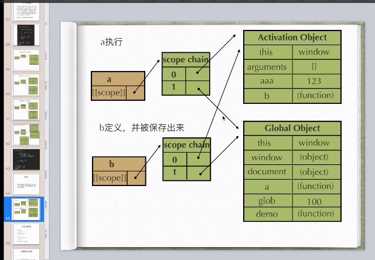

## js的底层知识

### 1. 说说函数预编译，执行期上下文，作用域

- (1) 创建全局的执行期上下文（GO）

- (2) 函数定义的时候作用域指向GO

- (3) 在函数执行之前创建执行期上下文，将执行期上下文放在作用域链的最顶端

- (4) 在创建执行期之前进行变量生命提升，函数生命提升，(函数预编译)

- (5) 在函数执行完成的时候，销毁执行期上下文，恢复定义时的执行期上下文

- (6) 如果函数执行完成的时候，内部的函数被保存到外部，就会形成闭包

- (7) 内部函数定义时会拿去外层函数作用域作为自己的作用域

- (8) 所以内部函数被保存到外部仍然可以拿到外部函数作用域中的值

  

