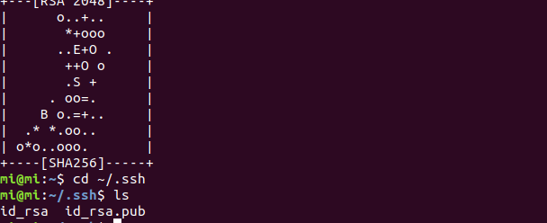
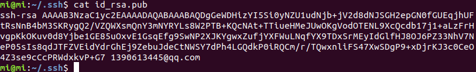

## 帮助中心

https://help.apple.com/macos/big-sur/mac-basics/?lang=zh-hans&cases=kIFAGHvXTAepRptQXiXe5w,N0bfKOvERSiAp06mHOcgOQ&notification=0#notifications

Hevin

### git 下载

https://brew.sh/index_zh-cn 

### 怎么选中大量的代码文本进行删除 ？

下载Homebrew后好像会默认安装git

### 反撤销

command + shift + z

### 1. 打开设置的快捷键 

command + ,

### 2. Visual studio code快捷键

command + f

### 3. 剪切的快捷键

command + option + v

### 4. 一键退出所有窗口

command + q

### 5. nrm,nvm

sudo npm install -g nrm

https://qizhanming.com/blog/2020/07/29/how-to-install-node-using-nvm-on-macos-with-brew

### 6. ssh

### 7. 搜索mac应用和文件

command + 空格

### 8. 插入图片的快捷键

control + command + i

### 显示md文件源码的快捷键

command + /

### 9. Visual code 默认字体

'Consolas', 'monospace', monospace, 'Droid Sans Fallback'

'Droid Sans Mono', 'monospace', monospace, 'Droid Sans Fallback'

#### 10. 隐藏所有窗口 fn + f12

#### 11. 查找文件

Command + shift + g
