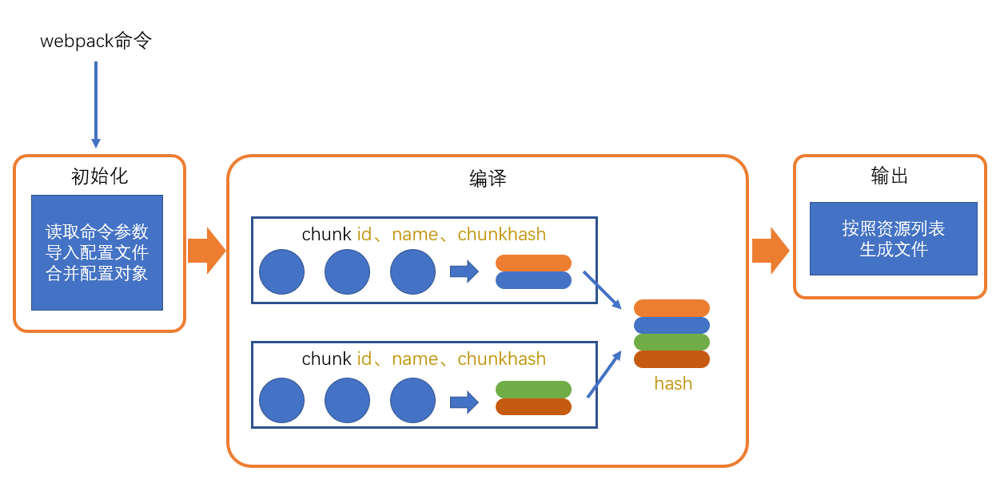

[TOC]


# 一．webpack初级知识

# 1. 了解webpack

###  (1)  webpack主要做啥的

- webpack做的事情，仅仅是分析出各种模块的依赖关系，然后形成资源列表，最终打包到指定的文件中。

-  更多的功能需要借助webpack loaders 和 wepack plugins完成


###  (2)  webpack.config.js

- 在node环境中进行文件大打包，读取文件，分析出文件的依赖关系

- 在打包过程中，仅仅是处理文件的依赖关系，不会执行文件

- webpack.config.js是在node环境中进行执行的，仅支持node环境的语法解构

###  (3)   webpack流程图

- https://www.yuque.com/u2102367/lzfa30/kigfgx/edit
- 


###  (4)  webpack --config  build/webpack.config.js
- 执行指定文件夹下webpack的配置文件

# 2. 如何安装webpack

###  (1)  安装
- npm install --save-dev(-D) webpack webpack-cli

### (2) webpack：核心包，包含了webpack构建过程中要用到的所有api

### (3)  webpack-cli：提供一个简单的cli命令，它调用了webpack核心包的api，来完成构建过程

- 默认情况下，src/index.js是默认入口，dist/main.js是默认出口

###  开发模式　--mode=development
###  生产模式　--mode=production

```js
	"build": "webpack --mode=production",
    "dev": "webpack --mode development"
```

# 3. webpack的配置文件


webpack提供的cli支持很多的参数，例如```--mode```，但更多的时候，我们会使用更加灵活的配置文件来控制webpack的行为

默认情况下，webpack会读取```webpack.config.js```文件作为配置文件，但也可以通过CLI参数```--config```来指定某个配置文件

配置文件中通过CommonJS模块导出一个对象，对象中的各种属性对应不同的webpack配置

**注意：配置文件中的代码，必须是有效的node代码**

当命令行参数与配置文件中的配置出现冲突时，以命令行参数为准。

**基本配置：**

1. mode：编译模式，字符串，取值为development或production，指定编译结果代码运行的环境，会影响webpack对编译结果代码格式的处理
2. entry：入口，字符串（后续会详细讲解），指定入口文件
3. output：出口，对象（后续会详细讲解），指定编译结果文件

### (1)  得到当前文件的目录

- path: __dirname + '/dist'

### (2) 得到node运行的目录

- 在webpack配置文件中，getPath代表node运行的目录
- let getPath = path.resolve('./');

### source-map

- souce map 可以当运行发生错误的时候，我们更加希望能看到源代码中的错误，而不是转换后代码的错误

　devtool:hidden-source-map

- SourceMapDevToolPlugin插件可以来配置source-map,他的可配置性更高

###  entry
- 在你想要多个依赖文件一起注入，并且将它们的依赖导向(graph)到一个“chunk”时，传入数组的方式就很有用
    entry:{
        test:['./entry1.js','./entry2.js']
    },
- 将多个js文件，合并成一个模块
- entry的路径默认是相对于webpack执行的目录 == package.json所在的同级

### output
[id].[chunkhash:5]
__dirname + '/dist'

 output:{
    path:
    filename:[id].[chunkhash:5].js
 }

name：chunkname
hash: 总的资源hash，通常用于解决缓存问题
chunkhash: 使用chunkhash
id: 使用chunkid，不推荐

# 4. webpack的编译结果

### 建议结果的分析
```js


//编译结果分析
//合并模块
//将每个模块的路径，当做唯一的标示，进行合并
(function(modules){
    let cacheModules = {};
    function _require(moduleId){
        if(cacheModules[moduleId]){//缓存模块
            return cacheModules[moduleId]
        }
        let func = modules[moduleId];
        let module = {
            exports:{

            }
        }
        func(module,module.exports,_require);
        let result = module.exports;
        cacheModules[moduleId] = result
        return result;
    }
    _require('./index');//引用入口文件
    _require('./index2');//引用入口文件
})({
    './index':function(module,exports,_require){
        console.log('index')
        let a = _require('./a')
        console.log(a)
    },
    './index2':function(module,exports,_require){
        console.log('index2')
        let a = _require('./a')
        console.log(a)
    },
    './a':function(module,exports,_require){
        console.log('我在a')
        module.exports = '111';
    }
})
```

# 5. webpack的编译过程

## webpack 编译过程 {ignore}

webpack 的作用是将源代码编译（构建、打包）成最终代码


整个过程大致分为三个步骤

1. 初始化
2. 编译
3. 输出


## 初始化

此阶段，webpack会将**CLI参数**、**配置文件**、**默认配置**进行融合，形成一个最终的配置对象。

对配置的处理过程是依托一个第三方库```yargs```完成的

此阶段相对比较简单，主要是为接下来的编译阶段做必要的准备

目前，可以简单的理解为，初始化阶段主要用于产生一个最终的配置

## 编译

1. **创建chunk**

chunk是webpack在内部构建过程中的一个概念，译为```块```，它表示通过某个入口找到的所有依赖的统称。

根据入口模块（默认为```./src/index.js```）创建一个chunk


每个chunk都有至少两个属性：

- name：默认为main
- id：唯一编号，开发环境和name相同，生产环境是一个数字，从0开始

2. **构建所有依赖模块**

   **dependencies，记录依赖关系**

   {
    ./src/index.js : function(){}
   }
   


> AST在线测试工具：https://astexplorer.net/

简图


3. **产生chunk assets**

在第二步完成后，chunk中会产生一个模块列表，列表中包含了**模块id**和**模块转换后的代码**

接下来，webpack会根据配置为chunk生成一个资源列表，即```chunk assets```，资源列表可以理解为是生成到最终文件的文件名和文件内容


> chunk hash是根据所有chunk assets的内容生成的一个hash字符串
> hash：一种算法，具体有很多分类，特点是将一个任意长度的字符串转换为一个固定长度的字符串，而且可以保证原始内容不变，产生的hash字符串就不变

简图


4. **合并chunk assets**

将多个chunk的assets合并到一起，并产生一个总的hash


## 输出

此步骤非常简单，webpack将利用node中的fs模块（文件处理模块），根据编译产生的总的assets，生成相应的文件。


## 总过程


**涉及术语**

1. module：模块，分割的代码单元，webpack中的模块可以是任何内容的文件，不仅限于JS
2. chunk：webpack内部构建模块的块，一个chunk中包含多个模块，这些模块是从入口模块通过依赖分析得来的
3. bundle：chunk构建好模块后会生成chunk的资源清单，清单中的每一项就是一个bundle，可以认为bundle就是最终生成的文件
4. hash：最终的资源清单所有内容联合生成的hash值
5. chunkhash：chunk生成的资源清单内容联合生成的hash值
6. chunkname：chunk的名称，如果没有配置则使用main
7. id：通常指chunk的唯一编号，如果在开发环境下构建，和chunkname相同；如果是生产环境下构建，则使用一个从0开始的数字进行编号


# ６. loader

###  loader

- **webpack loader： loader本质上是一个函数，它的作用是将某个源码字符串转换成另一个源码字符串返回**

- https://juejin.im/post/6844903555673882632

> webpack做的事情，仅仅是分析出各种模块的依赖关系，然后形成资源列表，最终打包生成到指定的文件中。
> 更多的功能需要借助webpack loaders和webpack plugins完成。

webpack loader： loader本质上是一个函数，它的作用是将某个源码字符串转换成另一个源码字符串返回



**loader函数的将在模块解析的过程中被调用，以得到最终的源码**

**全流程：**



**chunk中解析模块的流程：**


**chunk中解析模块的更详细流程：**


**处理loaders流程：**


**loader配置：**

**完整配置**

```js
module.exports = {
    module: { //针对模块的配置，目前版本只有两个配置，rules、noParse
        rules: [ //模块匹配规则，可以存在多个规则
            { //每个规则是一个对象
                test: /\.js$/, //匹配的模块正则
                use: [ //匹配到后应用的规则模块
                    {  //其中一个规则
                        loader: "模块路径", //loader模块的路径，该字符串会被放置到require中
                        options: { //向对应loader传递的额外参数

                        }
                    }
                ]
            }
        ]
    }
}
```

**简化配置**

```js
module.exports = {
    module: { //针对模块的配置，目前版本只有两个配置，rules、noParse
        rules: [ //模块匹配规则，可以存在多个规则
            { //每个规则是一个对象
                test: /\.js$/, //匹配的模块正则
                use: ["模块路径1", "模块路径2"]//loader模块的路径，该字符串会被放置到require中
            }
        ]
    }
}
```

###  loader的本质

- 本质也是一个模块，最后会通过module.exports导出东西

# 7.plugin

**loader的功能定位是转换代码，而一些其他的操作难以使用loader完成，比如：**

- 当webpack生成文件时，顺便多生成一个说明描述文件
- 当webpack编译启动时，控制台输出一句话表示webpack启动了
- 当xxxx时，xxxx

这种类似的功能需要把功能嵌入到**webpack的编译流程中**，而这种事情的实现是依托于plugin的


plugin的**本质**是一个带有apply方法的对象

```js
var plugin = {
    apply: function(compiler){
        
    }
}
```

通常，习惯上，我们会将该对象写成构造函数的模式

```js
class MyPlugin{
    apply(compiler){

    }
}

var plugin = new MyPlugin();
```

要将插件应用到webpack，需要把插件对象配置到webpack的plugins数组中，如下：

```js
module.exports = {
    plugins:[
        new MyPlugin()
    ]
}
```

apply函数会在初始化阶段，创建好Compiler对象后运行。

compiler对象是在初始化阶段构建的，整个webpack打包期间只有一个compiler对象，后续完成打包工作的是compiler对象内部创建的compilation

apply方法会在**创建好compiler对象后调用**，并向方法传入一个compiler对象


compiler对象提供了大量的钩子函数（hooks，可以理解为事件），plugin的开发者可以注册这些钩子函数，参与webpack编译和生成。

你可以在apply方法中使用下面的代码注册钩子函数:

```js
class MyPlugin{
    apply(compiler){
        compiler.hooks.事件名称.事件类型(name, function(compilation){
            //事件处理函数
        })
    }
}
```

**事件名称**

即要监听的事件名，即钩子名，所有的钩子：https://www.webpackjs.com/api/compiler-hooks

**事件类型**

这一部分使用的是 Tapable API，这个小型的库是一个专门用于钩子函数监听的库。

它提供了一些事件类型：

- tap：注册一个同步的钩子函数，函数运行完毕则表示事件处理结束
- tapAsync：注册一个基于回调的异步的钩子函数，函数通过调用一个回调表示事件处理结束
- tapPromise：注册一个基于Promise的异步的钩子函数，函数通过返回的Promise进入已决状态表示事件处理结束

**处理函数**

处理函数有一个事件参数```compilation```


# 8.webpack细节配置

### context

- 该配置会影响入口和loaders的解析，入口和loaders的相对路径会以context的配置作为基准路径，这样，你的配置会独立于CWD（current working directory 当前执行路径）

### output

> filename
> path
> library: "abc"  这样一来，打包后的结果中，会将自执行函数的执行结果暴露给abc  
> libraryTarget: "var"  该配置可以更加精细的控制如何暴露入口包的导出结果
- https://www.webpackjs.com/configuration/output/#output-librarytarget

### target 

> 设置打包结果最终要运行的环境
> target:"web" //默认值

### module 加载器

> noParse: /jquery/
- 不解析正则表达式匹配的模块，通常用它来忽略那些大型的单模块库，以提高构建性能

### resolve

> **(1) modules **
- 当解析模块时，如果遇到导入语句，require("test")，webpack会从下面的位置寻找依赖的模块
- modulse:['node_modules','a'] //模块的查找位置

> **(2) extensions**

> - extensions: [".js", ".json"]  //默认值
- 当解析模块时，遇到无具体后缀的导入语句，例如require("test")，会依次测试它的后缀名

> **(3) alias** 
alias: {
  "@": path.resolve(__dirname, 'src'),
  "_": __dirname
}
- 有了alias（别名）后，导入语句中可以加入配置的键名，例如require("@/abc.js")，webpack会将其看作是require(src的绝对路径+"/abc.js")。
- 在大型系统中，源码结构往往比较深和复杂，别名配置可以让我们更加方便的导入依赖

### externals 从最终的bundle中排除掉配置的配置的源码

- 这比较适用于一些第三方库来自于外部CDN的情况，这样一来，即可以在页面中使用CDN，又让bundle的体积变得更小，还不影响源码的编写

###  stats

- stats控制的是构建过程中控制台的输出内容

# 9.webpack如何区分环境

- **(1) webpack --config webpack.config.js**
- **(2)** **通过配置文件传递参数来进行区分**
```js
    "scripts": {
        "dev": "webpack",
        "prod": "webpack --env.prod"
    }
```
有些时候，我们需要针对生产环境和开发环境分别书写webpack配置

为了更好的适应这种要求，webpack允许配置不仅可以是一个对象，还可以是一个**函数**

```js
module.exports = env => {
    return {
        //配置内容
    }
}
```

在开始构建时，webpack如果发现配置是一个函数，会调用该函数，将函数返回的对象作为配置内容，因此，开发者可以根据不同的环境返回不同的对象

在调用webpack函数时，webpack会向函数传入一个参数env，该参数的值来自于webpack命令中给env指定的值，例如

```shell
npx webpack --env abc # env: "abc"

npx webpack --env.abc # env: {abc:true}
npx webpack --env.abc=1  # env： {abc:1}
npx webpack --env.abc=1 --env.bcd=2 # env: {abc:1, bcd:2}
```

这样一来，我们就可以在命令中指定环境，在代码中进行判断，根据环境返回不同的配置结果。


# 二．webpack拓展

# 1.webpack常用的插件拓展

### (1) clear-webpack-plugin

> **清除文件夹目录**

- **开发中遇到的问题－插件不进行文件夹的清空**

  > 解决方式: 在output配置打包后的文件所在的目录即可解决

### **(2) html-webpack-plugin**

> **自动生成页面**

 HtmlWebpackPlugin 在此可以用于自动重新生成一个index.html或依据模板生成
  帮你把所有生产的js文件引入到html中，最终生成到output目录
  ```js
    new HtmlWebpackPlugin({
      chunks:'all'
    })
  ```
  chunks:'all' 默认值会把所有的js都引进来

- copy-webpack-plugin 复制静态资源

```js
    new CopyWebpackPlugin({
        patterns: [{
            from: __dirname + '/dist',
            to:__dirname+ '/demo'
        }]
    })
```

### **(３)　copy-webpack-plugin**
> 复制静态文件到指定目录
```js
        new CopyWebpackPlugin({
            patterns: [{
                from: './public',
                to: './' //相对于输出的文件夹
            }]
        }),
```

### 　**(４)　webpack-dev-server**

> 开发服务器

在**开发阶段**，目前遇到的问题是打包、运行、调试过程过于繁琐，回顾一下我们的操作流程：

1. 编写代码
2. 控制台运行命令完成打包
3. 打开页面查看效果
4. 继续编写代码，回到步骤2

并且，我们往往希望把最终生成的代码和页面部署到服务器上，来模拟真实环境

为了解决这些问题，webpack官方制作了一个单独的库：**webpack-dev-server**

它**既不是plugin也不是loader**

先来看看它怎么用

1. 安装
2. 执行```webpack-dev-server```命令

```webpack-dev-server```命令几乎支持所有的webpack命令参数，如```--config```、```-env```等等，你可以把它当作webpack命令使用

这个命令是专门为开发阶段服务的，真正部署的时候还是得使用webpack命令

当我们执行```webpack-dev-server```命令后，它做了以下操作：

1. 内部执行webpack命令，传递命令参数
2. 开启watch
3. 注册hooks：类似于plugin，webpack-dev-server会向webpack中注册一些钩子函数，主要功能如下：
   1. 将资源列表（aseets）保存起来
   2. 禁止webpack输出文件
4. 用express开启一个服务器，监听某个端口，当请求到达后，根据请求的路径，给予相应的资源内容

**配置**

针对webpack-dev-server的配置，参考：https://www.webpackjs.com/configuration/dev-server/

常见配置有：

- port：配置监听端口
- proxy：配置代理，常用于跨域访问
- stats：配置控制台输出内容

```js
   devServer:{ 　　
        port:9090, //端口号
        open:true, //是否打开浏览器
        proxy:{　　//配置服务器代理
            '/api':{
                target:'http://open.duyiedu.com',
                changeOrigin: true //更改请求头中的host和origin
            }
        }
    }
```
### 　**(5)　普通文件处理**

- **file-loader url-loader**

> file-loader:生成依赖的文件到输出目录,然后将模块文件设置为：导处一个路径

```js
//file-loader
function loader(source){
	// source：文件内容（图片内容 buffer）
	// 1. 生成一个具有相同文件内容的文件到输出目录　（将需要处理的图片打包的目标文件夹中）
	// 2. 返回一段代码   export default "文件名"　（处理源码字符串后返回新生成图片的路径）
}
```

> url-loader:将依赖的文件转换为：导出一个base64格式的字符串
```js
//url-loader
function loader(source){
	// source：文件内容（图片内容 buffer）
	// 1. 根据buffer生成一个base64编码
	// 2. 返回一段代码   export default "base64编码"
}
```

### 　**(6)　解决路径问题**

在使用file-loader或url-loader时，可能会遇到一个非常有趣的问题

比如，通过webpack打包的目录结构如下：

```yaml
dist
    |—— img
        |—— a.png  #file-loader生成的文件
    |—— scripts
        |—— main.js  #export default "img/a.png"
    |—— html
        |—— index.html #<script src="../scripts/main.js" ></script>
```

这种问题发生的根本原因：模块中的路径来自于某个loader或plugin，当产生路径时，loader或plugin只有相对于dist目录的路径，并不知道该路径将在哪个资源中使用，从而无法确定最终正确的路径

面对这种情况，需要依靠webpack的配置**publicPath**解决

### 　**(7)　内置插件**

所有的webpack内置插件都作为webpack的静态属性存在的，使用下面的方式即可创建一个插件对象

```js
const webpack = require("webpack")
new webpack.插件名(options)
```

> **DefinePlugiv**

全局常量定义插件，使用该插件通常定义一些常量值，例如：

```js
new webpack.DefinePlugin({
    PI: `Math.PI`, // PI = Math.PI
    VERSION: `"1.0.0"`, // VERSION = "1.0.0"
    DOMAIN: JSON.stringify("duyi.com")
})
```

这样一来，在源码中，我们可以直接使用插件中提供的常量，当webpack编译完成后，会自动替换为常量的值

> **BannerPlugin**

它可以为每个chunk生成的文件头部添加一行注释，一般用于添加作者、公司、版权等信息

```js
new webpack.BannerPlugin({
  banner: `
  hash:[hash]
  chunkhash:[chunkhash]
  name:[name]
  author:yuanjin
  corporation:duyi
  `
})
```

>  **ProvidePlugin**

自动加载模块，而不必到处 import 或 require 

```js
new webpack.ProvidePlugin({
  $: 'jquery',
  _: 'lodash'
})
```

然后在我们任意源码中：

```js
$('#item'); // <= 起作用
_.drop([1, 2, 3], 2); // <= 起作用
```


# 三．css工程化

# 1. css的问题

> ### 类名冲突的问题
>
> > BEM
> >
> > CSS IN JS
> >
> > CSS Modules
>
> ### 重复样式
>
> > CSS IN JSS
> >
> > LESS 
> >
> > SASS
>
> ### css文件细分问题
>
> > webpack

# 2. webpack拆分css

要拆分css，就必须把css当成像js那样的模块；

**要把css当成模块，就必须有一个构建工具（webpack），它具备合并代码的能力**

而webpack本身只能读取css文件的内容、将其当作JS代码进行分析，因此，会导致错误

**于是，就必须有一个loader，能够将css代码转换为js代码**

## css-loader

**css-loader的作用，就是将css代码转换为js代码**

它的处理原理极其简单：将css代码作为字符串导出

例如：

```css
.red{
    color:"#f40";
}
```

经过css-loader转换后变成js代码：

```js
module.exports = `.red{
    color:"#f40";
}`
```

> 上面的js代码是经过我简化后的，不代表真实的css-loader的转换后代码，css-loader转换后的代码会有些复杂，同时会导出更多的信息，但核心思想不变

再例如：

```css
.red{
    color:"#f40";
    background:url("./bg.png")
}
```

经过css-loader转换后变成js代码：

```js
var import1 = require("./bg.png");
module.exports = `.red{
    color:"#f40";
    background:url("${import1}")
}`;
```

这样一来，经过webpack的后续处理，会把依赖```./bg.png```添加到模块列表，然后再将代码转换为

```js
var import1 = __webpack_require__("./src/bg.png");
module.exports = `.red{
    color:"#f40";
    background:url("${import1}")
}`;
```

再例如：

```css
@import "./reset.css";
.red{
    color:"#f40";
    background:url("./bg.png")
}
```

会转换为：

```js
var import1 = require("./reset.css");
var import2 = require("./bg.png");
module.exports = `${import1}
.red{
    color:"#f40";
    background:url("${import2}")
}`;
```

总结，css-loader干了什么：

1. **将css文件的内容作为字符串导出**
2. **将css中的其他依赖作为require导入，以便webpack分析依赖**

## style-loader

由于css-loader仅提供了将css转换为字符串导出的能力，剩余的事情要交给其他loader或plugin来处理

style-loader可以将css-loader转换后的代码进一步处理，将css-loader导出的字符串加入到页面的style元素中

例如：

```css
.red{
    color:"#f40";
}
```

经过css-loader转换后变成js代码：

```js
module.exports = `.red{
    color:"#f40";
}`
```

经过style-loader转换后变成：

```js
module.exports = `.red{
    color:"#f40";
}`
var style = module.exports;
var styleElem = document.createElement("style");
styleElem.innerHTML = style;
document.head.appendChild(styleElem);
module.exports = {}
```

> 以上代码均为简化后的代码，并不代表真实的代码
> style-loader有能力避免同一个样式的重复导入


# 3. BEM、css in js

# 4. css module

> 通过命名规范来限制类名太过死板，而css in js虽然足够灵活，但是书写不便。
> css module 开辟一种全新的思路来解决类名冲突的问题

## (1) 思路

**css module 遵循以下思路解决类名冲突问题：**

1. css的类名冲突往往发生在大型项目中
2. 大型项目往往会使用构建工具（webpack等）搭建工程
3. 构建工具允许将css样式切分为更加精细的模块
4. 同JS的变量一样，每个css模块文件中难以出现冲突的类名，冲突的类名往往发生在不同的css模块文件中
5. 只需要保证构建工具在合并样式代码后不会出现类名冲突即可


## (2) 实现原理

在webpack中，作为处理css的css-loader，它实现了css module的思想，要启用css module，需要将css-loader的配置```modules```设置为```true```。

css-loader的实现方式如下：


原理极其简单，开启了css module后，css-loader会将样式中的类名进行转换，转换为一个唯一的hash值。

由于hash值是根据模块路径和类名生成的，因此，不同的css模块，哪怕具有相同的类名，转换后的hash值也不一样。


## (3) 如何应用样式

css module带来了一个新的问题：源代码的类名和最终生成的类名是不一样的，而开发者只知道自己写的源代码中的类名，并不知道最终的类名是什么，那如何应用类名到元素上呢？

为了解决这个问题，css-loader会导出原类名和最终类名的对应关系，该关系是通过一个对象描述的


这样一来，我们就可以在js代码中获取到css模块导出的结果，从而应用类名了

style-loader为了我们更加方便的应用类名，会去除掉其他信息，仅暴露对应关系

## (4) 其他操作

### 全局类名

某些类名是全局的、静态的，不需要进行转换，仅需要在类名位置使用一个特殊的语法即可：

```css
:global(.main){
    ...
}
```

使用了global的类名不会进行转换，相反的，没有使用global的类名，表示默认使用了local

```css
:local(.main){
    ...
}
```

使用了local的类名表示局部类名，是可能会造成冲突的类名，会被css module进行转换

### 如何控制最终的类名

绝大部分情况下，我们都不需要控制最终的类名，因为控制它没有任何意义

如果一定要控制最终的类名，需要配置css-loader的```localIdentName```

## (5) 其他注意事项

- css module往往配合构建工具使用
- css module仅处理顶级类名，尽量不要书写嵌套的类名，也没有这个必要
- **css module仅处理类名，不处理其他选择器**
- css module还会处理id选择器，不过任何时候都没有使用id选择器的理由
- 使用了css module后，只要能做到让类名望文知意即可，不需要遵守其他任何的命名规范

# 5. 预编译器－less

## (1) 基本原理

编写css时，受限于css语言本身，常常难以处理一些问题：

- 重复的样式值：例如常用颜色、常用尺寸
- 重复的代码段：例如绝对定位居中、清除浮动
- 重复的嵌套书写

由于官方迟迟不对css语言本身做出改进，一些第三方机构开始想办法来解决这些问题

其中一种方案，便是预编译器

预编译器的原理很简单，即使用一种更加优雅的方式来书写样式代码，通过一个编译器，将其转换为可被浏览器识别的传统css代码


目前，最流行的预编译器有**LESS**和**SASS**，由于它们两者特别相似，因此仅学习一种即可（本课程学习LESS）


> less官网：http://lesscss.org/
> less中文文档1（非官方）：http://lesscss.cn/
> less中文文档2（非官方）：https://less.bootcss.com/
> sass官网：https://sass-lang.com/
> sass中文文档1（非官方）：https://www.sass.hk/
> sass中文文档2（非官方）：https://sass.bootcss.com/

## (2) LESS的安装和使用

从原理可知，要使用LESS，必须要安装LESS编译器

LESS编译器是基于node开发的，可以通过npm下载安装

```shell
npm i -D less
```

安装好了less之后，它提供了一个CLI工具`lessc`，通过该工具即可完成编译

```shell
lessc less代码文件 编译后的文件
```

试一试:

新建一个`index.less`文件，编写内容如下：

```less
// less代码
@red: #f40;

.redcolor {
    color: @red;
}
```

运行命令：

```shell
lessc index.less index.css
```

可以看到编译之后的代码：

```css
.redcolor {
  color: #f40;
}
```

## (3) LESS的基本使用

具体的使用见文档：https://less.bootcss.com/

- 变量
- 混合
- 嵌套
- 运算
- 函数
- 作用域
- 注释
- 导入

# 6. 后处理器－postcss

- (提供一个环境,会把css代码给补齐)

## (1) 什么是PostCss

可以看出，CSS工程化面临着诸多问题，而解决这些问题的方案多种多样。

如果把CSS单独拎出来看，光是样式本身，就有很多事情要处理。

既然有这么多事情要处理，何不把这些事情集中到一起统一处理呢？

PostCss就是基于这样的理念出现的。

PostCss类似于一个编译器，可以将样式源码编译成最终的CSS代码


看上去是不是和LESS、SASS一样呢？

但PostCss和LESS、SASS的思路不同，它其实只做一些代码分析之类的事情，将分析的结果交给插件，具体的代码转换操作是插件去完成的。


官方的一张图更能说明postcss的处理流程：


> 这一点有点像webpack，webpack本身仅做依赖分析、抽象语法树分析，其他的操作是靠插件和加载器完成的。

官网地址：https://postcss.org/
github地址：https://github.com/postcss/postcss

## (2) 安装

PostCss是基于node编写的，因此可以使用npm安装

```shell
npm i -D postcss
```

postcss库提供了对应的js api用于转换代码，如果你想使用postcss的一些高级功能，或者想开发postcss插件，就要api使用postcss，api的文档地址是：http://api.postcss.org/

不过绝大部分时候，我们都是使用者，并不希望使用代码的方式来使用PostCss

因此，我们可以再安装一个postcss-cli，通过命令行来完成编译

```shell
npm i -D postcss-cli
```

postcss-cli提供一个命令，它调用postcss中的api来完成编译

命令的使用方式为：

```shell
postcss 源码文件 -o 输出文件
```

## (3) 配置文件

和webpack类似，postcss有自己的配置文件，该配置文件会影响postcss的某些编译行为。

配置文件的默认名称是：```postcss.config.js```

例如：

```js
module.exports = {
    map: false, //关闭source-map
}
```

## (4) 插件

光使用postcss是没有多少意义的，要让它真正的发挥作用，需要插件

postcss的插件市场：https://www.postcss.parts/

下面罗列一些postcss的常用插件

## postcss-preset-env

过去使用postcss的时候，往往会使用大量的插件，它们各自解决一些问题

这样导致的结果是安装插件、配置插件都特别的繁琐

于是出现了这么一个插件`postcss-preset-env`，它称之为`postcss预设环境`，大意就是它整合了很多的常用插件到一起，并帮你完成了基本的配置，你只需要安装它一个插件，就相当于安装了很多插件了。

安装好该插件后，在postcss配置中加入下面的配置

```js
module.exports = {
    plugins: {
        "postcss-preset-env": {} // {} 中可以填写插件的配置
    }
}
```

该插件的功能很多，下面一一介绍

### 自动的厂商前缀

某些新的css样式需要在旧版本浏览器中使用厂商前缀方可实现

例如

```css
::placeholder {
    color: red;
}
```

该功能在不同的旧版本浏览器中需要书写为

```css
::-webkit-input-placeholder {
    color: red;
}
::-moz-placeholder {
    color: red;
}
:-ms-input-placeholder {
    color: red;
}
::-ms-input-placeholder {
    color: red;
}
::placeholder {
    color: red;
}
```

要完成这件事情，需要使用`autoprefixer`库。

而`postcss-preset-env`内部包含了该库，自动有了该功能。

如果需要调整**兼容的浏览器**范围，可以通过下面的方式进行配置

**方式1：在postcss-preset-env的配置中加入browsers**

```js
module.exports = {
    plugins: {
        "postcss-preset-env": {
            browsers: [
                "last 2 version",
                "> 1%"
            ]
        } 
    }
}
```

**方式2【推荐】：添加 .browserslistrc 文件**

创建文件`.browserslistrc`，填写配置内容

```
last 2 version
> 1%
```

**方式3【推荐】：在package.json的配置中加入browserslist**

```json
"browserslist": [
    "last 2 version",
    "> 1%"
]
```

`browserslist`是一个多行的（数组形式的）标准字符串。

它的书写规范多而繁琐，详情见：https://github.com/browserslist/browserslist

一般情况下，大部分网站都使用下面的格式进行书写

```
last 2 version
> 1% in CN
not ie <= 8
```

- `last 2 version`: 浏览器的兼容最近期的两个版本
- `> 1% in CN`: 匹配中国大于1%的人使用的浏览器， `in CN`可省略
- `not ie <= 8`: 排除掉版本号小于等于8的IE浏览器

> 默认情况下，匹配的结果求的是并集

你可以通过网站：https://browserl.ist/ 对配置结果覆盖的浏览器进行查询，查询时，多行之间使用英文逗号分割

> browserlist的数据来自于[CanIUse](http://caniuse.com/)网站，由于数据并非实时的，所以不会特别准确

### 未来的CSS语法

CSS的某些前沿语法正在制定过程中，没有形成真正的标准，如果希望使用这部分语法，为了浏览器兼容性，需要进行编译

过去，完成该语法编译的是`cssnext`库，不过有了`postcss-preset-env`后，它自动包含了该功能。

你可以通过`postcss-preset-env`的`stage`配置，告知`postcss-preset-env`需要对哪个阶段的css语法进行兼容处理，它的默认值为2

```js
"postcss-preset-env": {
    stage: 0
}
```

一共有5个阶段可配置：

- Stage 0: Aspirational - 只是一个早期草案，极其不稳定
- Stage 1: Experimental - 仍然极其不稳定，但是提议已被W3C公认
- Stage 2: Allowable - 虽然还是不稳定，但已经可以使用了
- Stage 3: Embraced - 比较稳定，可能将来会发生一些小的变化，它即将成为最终的标准
- Stage 4: Standardized - 所有主流浏览器都应该支持的W3C标准

了解了以上知识后，接下来了解一下未来的css语法，尽管某些语法仍处于非常早期的阶段，但是有该插件存在，编译后仍然可以被浏览器识别

#### 变量

未来的css语法是天然支持变量的

在`:root{}`中定义常用变量，使用`--`前缀命名变量
**在新版的谷歌浏览器也支持这种写法**

```css
:root{
    --lightColor: #ddd;
    --darkColor: #333;
}

a{
    color: var(--lightColor);
    background: var(--darkColor);
}
```

> 编译后，仍然可以看到原语法，因为某些新语法的存在并不会影响浏览器的渲染，尽管浏览器可能不认识
> 如果不希望在结果中看到新语法，可以配置`postcss-preset-env`的`preserve`为`false`

#### 自定义选择器

```css
@custom-selector :--heading h1, h2, h3, h4, h5, h6;
@custom-selector :--enter :focus,:hover;

a:--enter{
    color: #f40;
}

:--heading{
    font-weight:bold;
}

:--heading.active{
    font-weight:bold;
}
```

编译后

```css
a:focus,a:hover{
    color: #f40;
}

h1,h2,h3,h4,h5,h6{
    font-weight:bold;
}

h1.active,h2.active,h3.active,h4.active,h5.active,h6.active{
    font-weight:bold;
}
```

#### 嵌套

与LESS相同，只不过嵌套的选择器前必须使用符号`&`

```less
.a {
    color: red;
    & .b {
        color: green;
    }

    & > .b {
        color: blue;
    }

    &:hover {
        color: #000;
    }
}
```

编译后

```css
.a {
    color: red
}

.a .b {
    color: green;
}

.a>.b {
    color: blue;
}

.a:hover {
    color: #000;
}
```

## postcss-apply

该插件可以支持在css中书写属性集

类似于LESS中的混入，可以利用CSS的新语法定义一个CSS代码片段，然后在需要的时候应用它

```less
:root {
  --center: {
    position: absolute;
    left: 50%;
    top: 50%;
    transform: translate(-50%, -50%);
  };
}

.item{
    @apply --center;
}
```

编译后

```css
.item{
  position: absolute;
  left: 50%;
  top: 50%;
  -webkit-transform: translate(-50%, -50%);
  transform: translate(-50%, -50%);
}
```

> 实际上，该功能也属于cssnext，不知为何`postcss-preset-env`没有支持

## postcss-color-function

该插件支持在源码中使用一些颜色函数

```less
body {
    /* 使用颜色#aabbcc，不做任何处理，等同于直接书写 #aabbcc */
    color: color(#aabbcc);
    /* 将颜色#aabbcc透明度设置为90% */
    color: color(#aabbcc a(90%));
    /* 将颜色#aabbcc的红色部分设置为90% */
    color: color(#aabbcc red(90%));
    /* 将颜色#aabbcc调亮50%（更加趋近于白色），类似于less中的lighten函数 */
    color: color(#aabbcc tint(50%));
    /* 将颜色#aabbcc调暗50%（更加趋近于黑色），类似于less中的darken函数 */
    color: color(#aabbcc shade(50%));
}
```

编译后

```css
body {
    /* 使用颜色#aabbcc，不做任何处理，等同于直接书写 #aabbcc */
    color: rgb(170, 187, 204);
    /* 将颜色#aabbcc透明度设置为90% */
    color: rgba(170, 187, 204, 0.9);
    /* 将颜色#aabbcc的红色部分设置为90% */
    color: rgb(230, 187, 204);
    /* 将颜色#aabbcc调亮50%（更加趋近于白色），类似于less中的lighten函数 */
    color: rgb(213, 221, 230);
    /* 将颜色#aabbcc调暗50%（更加趋近于黑色），类似于less中的darken函数 */
    color: rgb(85, 94, 102);
}
```
## [扩展]postcss-import

该插件可以让你在`postcss`文件中导入其他样式代码，通过该插件可以将它们合并

> 由于后续的课程中，会将postcss加入到webpack中，而webpack本身具有依赖分析的功能，所以该插件的实际意义不大

## stylelint

> 官网：https://stylelint.io/

在实际的开发中，我们可能会错误的或不规范的书写一些css代码，stylelint插件会即时的发现错误

由于不同的公司可能使用不同的CSS书写规范，stylelint为了保持灵活，它本身并没有提供具体的规则验证

你需要安装或自行编写规则验证方案

通常，我们会安装`stylelint-config-standard`库来提供标准的CSS规则判定

安装好后，我们需要告诉stylelint使用该库来进行规则验证

告知的方式有多种，比较常见的是使用文件`.stylelintrc`

```json
//.styleintrc
{
  "extends": "stylelint-config-standard"
}
```

此时，如果你的代码出现不规范的地方，编译时将会报出错误

```css
body {
    background: #f4;
}
```


发生了两处错误：

1. 缩进应该只有两个空格
2. 十六进制的颜色值不正确

如果某些规则并非你所期望的，可以在配置中进行设置

```json
{
    "extends": "stylelint-config-standard",
    "rules": {
        "indentation": null
    }
}
```

设置为`null`可以禁用该规则，或者设置为4，表示一个缩进有4个空格。具体的设置需要参见stylelint文档：https://stylelint.io/

但是这种错误报告需要在编译时才会发生，如果我希望在编写代码时就自动在编辑器里报错呢？

既然想在编辑器里达到该功能，那么就要在编辑器里做文章

安装vscode的插件`stylelint`即可，它会读取你工程中的配置文件，按照配置进行实时报错

> 实际上，如果你拥有了`stylelint`插件，可以不需要在postcss中使用该插件了


## 在webpack中使用postcss


- postcss
- postcss-loader
- postcss-preset-env


# 7. 抽离css文件－mini-css-extract-plugin


目前，css代码被css-loader转换后，交给的是style-loader进行处理。

style-loader使用的方式是用一段js代码，将样式加入到style元素中。

而实际的开发中，我们往往希望依赖的样式最终形成一个css文件

此时，就需要用到一个库：`mini-css-extract-plugin`

该库提供了1个plugin和1个loader

- plugin：负责生成css文件
- loader：负责记录要生成的css文件的内容，同时导出开启css-module后的样式对象

使用方式：

```js
const MiniCssExtractPlugin = require("mini-css-extract-plugin")
module.exports = {
    module: {
        rules: [
            {
                test: /\.css$/, use: [MiniCssExtractPlugin.loader, "css-loader?modules"]
            }
        ]
    },
    plugins: [
        new MiniCssExtractPlugin() //负责生成css文件
    ]
}
```

**配置生成的文件名**

同`output.filename`的含义一样，即根据chunk生成的样式文件名

配置生成的文件名，例如`[name].[contenthash:5].css`

默认情况下，每个chunk对应一个css文件


# 四．js兼容性

# 1. babel初探

## (1) 什么是babel

babel的出现，就是用于解决这样的问题，它是一个`编译器`，可以把不同标准书写的语言，编译为统一的、能被各种浏览器识别的语言


由于语言的转换工作灵活多样，babel的做法和postcss、webpack差不多，它本身仅提供一些分析功能，真正的转换需要依托于插件完成


## (2) babel的安装

babel可以和构建工具联合使用，也可以独立使用

如果要独立的使用babel，需要安装下面两个库：

- @babel/core：babel核心库，提供了编译所需的所有api
- @babel/cli：提供一个命令行工具，调用核心库的api完成编译

```shell
npm i -D @babel/core @babel/cli
```

## (3) babel的使用

@babel/cli的使用极其简单

它提供了一个命令`babel`

```shell
# 按文件编译
babel 要编译的文件 -o 编辑结果文件

# 按目录编译
babel 要编译的整个目录 -d 编译结果放置的目录
```

## babel的配置

可以看到，babel本身没有做任何事情，真正的编译要依托于**babel插件**和**babel预设**来完成

> babel预设和postcss预设含义一样，是多个插件的集合体，用于解决一系列常见的兼容问题

如何告诉babel要使用哪些插件或预设呢？需要通过一个配置文件`.babelrc`

```json
{
    "presets": [],
    "plugins": []
}
```

# 2. babel进阶

## (1) babel预设
babel有多种预设，最常见的预设是`@babel/preset-env`

`@babel/preset-env`可以让你使用最新的JS语法，而无需针对每种语法转换设置具体的插件

**配置**

```json
{
    "presets": [
        "@babel/preset-env"
    ]
}
```

**兼容的浏览器**

`@babel/preset-env`需要根据兼容的浏览器范围来确定如何编译，和postcss一样，可以使用文件`.browserslistrc`来描述浏览器的兼容范围

```
last 3 version
> 1%
not ie <= 8
```

**自身的配置**

和`postcss-preset-env`一样，`@babel/preset-env`自身也有一些配置

> 具体的配置见：https://www.babeljs.cn/docs/babel-preset-env#options

配置方式是：

```json
{
    "presets": [
        ["@babel/preset-env", {
            "配置项1": "配置值",
            "配置项2": "配置值",
            "配置项3": "配置值"
        }]
    ]
}
```

其中一个比较常见的配置项是`usebuiltins`，该配置的默认值是false

它有什么用呢？由于该预设仅转换新的语法，并不对新的API进行任何处理

例如：

```js
new Promise(resolve => {
    resolve()
})
```

转换的结果为

```js
new Promise(function (resolve) {
  resolve();
});
```

如果遇到没有Promise构造函数的旧版本浏览器，该代码就会报错

而配置`usebuiltins`可以在编译结果中注入这些新的API，它的值默认为`false`，表示不注入任何新的API，可以将其设置为`usage`，表示根据API的使用情况，按需导入API

```json
{
    "presets": [
        ["@babel/preset-env", {
            "useBuiltIns": "usage",
            "corejs": 3
        }]
    ]
}
```
## (２) babel插件

> 上节课补充：@babel/polyfill 已过时，目前被`core-js`和`generator-runtime`所取代

除了预设可以转换代码之外，插件也可以转换代码，它们的顺序是：

- 插件在 Presets 前运行。
- 插件顺序从前往后排列。
- Preset 顺序是颠倒的（从后往前）。

通常情况下，`@babel/preset-env`只转换那些已经形成正式标准的语法，对于某些处于早期阶段、还没有确定的语法不做转换。

如果要转换这些语法，就要单独使用插件

下面随便列举一些插件

## `@babel/plugin-proposal-class-properties`

该插件可以让你在类中书写初始化字段

```js
class A {
    a = 1;
    constructor(){
        this.b = 3;
    }
}
```

## `@babel/plugin-proposal-function-bind`

该插件可以让你轻松的为某个方法绑定this

```js
function Print() {
    console.log(this.loginId);
}

const obj = {
    loginId: "abc"
};

obj::Print(); //相当于：Print.call(obj);
```

> 遗憾的是，目前vscode无法识别该语法，会在代码中报错，虽然并不会有什么实际性的危害，但是影响观感

## `@babel/plugin-proposal-optional-chaining`

```js
const obj = {
  foo: {
    bar: {
      baz: 42,
    },
  },
};

const baz = obj?.foo?.bar?.baz; // 42

const safe = obj?.qux?.baz; // undefined
```

## `babel-plugin-transform-remove-console`

​						该插件会移除源码中的控制台输出语句

```js
console.log("foo");
console.error("bar");
```

编译后

```js

```

## `@babel/plugin-transform-runtime`

用于提供一些公共的API，这些API会帮助代码转换


# 五．性能优化

## 1. 性能优化概述

本章所讲的性能优化主要体现在三个方面：


(1) **构建性能**
这里所说的构建性能，是指在**开发阶段的构建性能**，而不是生产环境的构建性能

优化的目标，**是降低从打包开始，到代码效果呈现所经过的时间**

构建性能会影响开发效率。构建性能越高，开发过程中时间的浪费越少

(2) **传输性能**

传输性能是指，打包后的JS代码传输到浏览器经过的时间

在优化传输性能时要考虑到：

1. 总传输量：所有需要传输的JS文件的内容加起来，就是总传输量，重复代码越少，总传输量越少
2. 文件数量：当访问页面时，需要传输的JS文件数量，文件数量越多，http请求越多，响应速度越慢
3. 浏览器缓存：JS文件会被浏览器缓存，被缓存的文件不会再进行传输

(3) **运行性能**

运行性能是指，JS代码在浏览器端的运行速度

它主要取决于我们如何书写高性能的代码

**永远不要过早的关注于性能**，因为你在开发的时候，无法完全预知最终的运行性能，过早的关注性能会极大的降低开发效率

---------

性能优化主要从上面三个维度入手

**性能优化没有完美的解决方案，需要具体情况具体分析**

## 2. 减少模块解析 

## (1) 什么叫做模块解析？


模块解析包括：**抽象语法树分析、依赖分析(require())、模块语法替换(_require)**

## (2) 不做模块解析会怎样？


如果某个模块不做解析，该模块经过loader处理后的代码就是最终代码。

如果没有loader对该模块进行处理，该模块的源码就是最终打包结果的代码。

如果不对某个模块进行解析，可以缩短构建时间

## (3) 哪些模块不需要解析？

模块中无其他依赖：一些已经打包好的第三方库，比如jquery

## (4) 如何让某个模块不要解析？

配置`module.noParse`，它是一个正则，被正则匹配到的模块不会解析


## 3. 优化loader性能

## (1) 进一步限制loader的应用范围

思路是：对于某些库，不使用loader

例如：babel-loader可以转换ES6或更高版本的语法，可是有些库本身就是用ES5语法书写的，不需要转换，使用babel-loader反而会浪费构建时间

lodash就是这样的一个库

> lodash是在ES5之前出现的库，使用的是ES3语法

通过`module.rule.exclude`或`module.rule.include`，排除或仅包含需要应用loader的场景

```js
module.exports = {
    module: {
        rules: [
            {
                test: /\.js$/,
                exclude: /lodash/,
                use: "babel-loader"
            }
        ]
    }
}
```

如果暴力一点，甚至可以排除掉`node_modules`目录中的模块，或仅转换`src`目录的模块

```js
module.exports = {
    module: {
        rules: [
            {
                test: /\.js$/,
                exclude: /node_modules/,
                //或
                // include: /src/,
                use: "babel-loader"
            }
        ]
    }
}
```

> 这种做法是对loader的范围进行进一步的限制，和noParse不冲突，想想看，为什么不冲突

## (2) 缓存loader的结果

我们可以基于一种假设：如果某个文件内容不变，经过相同的loader解析后，解析后的结果也不变

于是，可以将loader的解析结果保存下来，让后续的解析直接使用保存的结果

`cache-loader`可以实现这样的功能

```js
module.exports = {
  module: {
    rules: [
      {
        test: /\.js$/,
        use: ['cache-loader', ...loaders]
      },
    ],
  },
};
```

有趣的是，`cache-loader`放到最前面，却能够决定后续的loader是否运行

实际上，loader的运行过程中，还包含一个过程，即`pitch`


`cache-loader`还可以实现各自自定义的配置，具体方式见文档

## (3) 为loader的运行开启多线程

`thread-loader`会开启一个线程池，线程池中包含适量的线程

它会把后续的loader放到线程池的线程中运行，以提高构建效率

由于后续的loader会放到新的线程中，所以，后续的loader不能：

- 使用 webpack api 生成文件
- 无法使用自定义的 plugin api
- 无法访问 webpack options

> 在实际的开发中，可以进行测试，来决定`thread-loader`放到什么位置

**特别注意**，开启和管理线程需要消耗时间，在小型项目中使用`thread-loader`反而会增加构建时间

## 4. 热替换 HMR 

> 热替换并不能降低构建时间（可能还会稍微增加），但可以降低代码改动到效果呈现的时间

当使用`webpack-dev-server`时，考虑代码改动到效果呈现的过程


而使用了热替换后，流程发生了变化


## (1) 使用和原理

1. 更改配置

```js
module.exports = {
  devServer:{
    hot:true // 开启HMR
  },
  plugins:[ 
    // 可选
    new webpack.HotModuleReplacementPlugin()
  ]
}
```

2. 更改代码

```js
// index.js

if(module.hot){ // 是否开启了热更新
  module.hot.accept() // 接受热更新
}
```

首先，这段代码会参与最终运行！

当开启了热更新后，`webpack-dev-server`会向打包结果中注入`module.hot`属性

默认情况下，`webpack-dev-server`不管是否开启了热更新，当重新打包后，都会调用`location.reload`刷新页面

但如果运行了`module.hot.accept()`，将改变这一行为

`module.hot.accept()`的作用是让`webpack-dev-server`通过`socket`管道，把服务器更新的内容发送到浏览器


然后，将结果交给插件`HotModuleReplacementPlugin`注入的代码执行

插件`HotModuleReplacementPlugin`会根据覆盖原始代码，然后让代码重新执行

**所以，热替换发生在代码运行期**

## (2) 样式热替换

对于样式也是可以使用热替换的，但需要使用`style-loader`

因为热替换发生时，`HotModuleReplacementPlugin`只会简单的重新运行模块代码

因此`style-loader`的代码一运行，就会重新设置`style`元素中的样式

而`mini-css-extract-plugin`，由于它生成文件是在**构建期间**，运行期间并会也无法改动文件，因此它对于热替换是无效的


## 5. 手动分包

## (1) 基本原理

手动分包的总体思路是：

1. 先单独的打包公共模块


公共模块会被打包成为动态链接库(dll Dynamic Link Library)，并生成资源清单

2. 根据入口模块进行正常打包

打包时，如果发现模块中使用了资源清单中描述的模块，则不会形成下面的代码结构

```js
//源码，入口文件index.js
import $ from "jquery"
import _ from "lodash"
_.isArray($(".red"));
```

由于资源清单中包含`jquery`和`lodash`两个模块，因此打包结果的大致格式是：

```js
(function(modules){
  //...
})({
  // index.js文件的打包结果并没有变化
  "./src/index.js":
  function(module, exports, __webpack_require__){
    var $ = __webpack_require__("./node_modules/jquery/index.js")
    var _ = __webpack_require__("./node_modules/lodash/index.js")
    _.isArray($(".red"));
  },
  // 由于资源清单中存在，jquery的代码并不会出现在这里
  "./node_modules/jquery/index.js":
  function(module, exports, __webpack_require__){
    module.exports = jquery;
  },
  // 由于资源清单中存在，lodash的代码并不会出现在这里
  "./node_modules/lodash/index.js":
  function(module, exports, __webpack_require__){
    module.exports = lodash;
  }
})
```

## (2) 打包公共模块

打包公共模块是一个**独立的**打包过程

1. 单独打包公共模块，暴露变量名

```js
// webpack.dll.config.js
module.exports = {
  mode: "production",
  entry: {
    jquery: ["jquery"],
    lodash: ["lodash"]
  },
  output: {
    filename: "dll/[name].js",
    library: "[name]"
  }
};

```

2. 利用`DllPlugin`生成资源清单

```js
// webpack.dll.config.js
module.exports = {
  plugins: [
    new webpack.DllPlugin({
      path: path.resolve(__dirname, "dll", "[name].manifest.json"), //资源清单的保存位置
      name: "[name]"//资源清单中，暴露的变量名
    })
  ]
};

```

运行后，即可完成公共模块打包

## (3) 使用公共模块

1. 在页面中手动引入公共模块

```html
<script src="./dll/jquery.js"></script>
<script src="./dll/lodash.js"></script>
```

2. 重新设置`clean-webpack-plugin`

如果使用了插件`clean-webpack-plugin`，为了避免它把公共模块清除，需要做出以下配置

```js
new CleanWebpackPlugin({
  // 要清除的文件或目录
  // 排除掉dll目录本身和它里面的文件
  cleanOnceBeforeBuildPatterns: ["**/*", '!dll', '!dll/*']
})
```

> 目录和文件的匹配规则使用的是[globbing patterns](https://github.com/sindresorhus/globby#globbing-patterns)

3. 使用`DllReferencePlugin`控制打包结果

```js
module.exports = {
  plugins:[
    new webpack.DllReferencePlugin({
      manifest: require("./dll/jquery.manifest.json")
    }),
    new webpack.DllReferencePlugin({
      manifest: require("./dll/lodash.manifest.json")
    })
  ]
}

```

## (4) 总结

**手动打包的过程**：

1. 开启`output.library`暴露公共模块
2. 用`DllPlugin`创建资源清单
3. 用`DllReferencePlugin`使用资源清单

**手动打包的注意事项**：

1. 资源清单不参与运行，可以不放到打包目录中
2. 记得手动引入公共JS，以及避免被删除
3. 不要对小型的公共JS库使用

**优点**：

1. 极大提升自身模块的打包速度
2. 极大的缩小了自身文件体积
3. 有利于浏览器缓存第三方库的公共代码

**缺点**：

1. 使用非常繁琐
2. 如果第三方库中包含重复代码，则效果不太理想