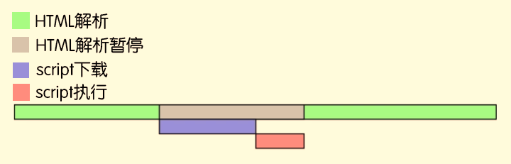
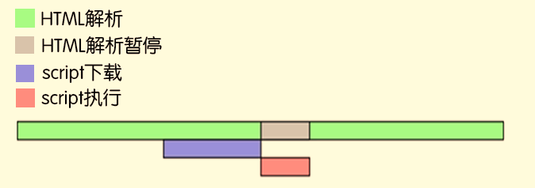
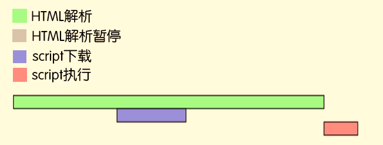

# 前端知识收集


## 琐碎知识收集

- ####  **如何实现一个高斯模糊 ?**

  1. 使用css3中filter:blur(5px)进行设置
  2. 使用canvas实现

- **如何计算某个颜色的反色后的颜色?**

    ```javascript
    var box = document.querySelector('.box')
    styles = window.getComputedStyle(box)
    original = styles.backgroundColor
    console.log(original)
    channels = original.match(/\d+/g) 
    inverted_channels = channels.map(function(ch) {
        return 255 - ch;
    })
    inverted = 'rgb(' + inverted_channels.join(', ') + ')';
    console.log(inverted)
    
    ```

- **在使用display:flex; 弹性布局后, 子元素超出部分隐藏text-overflow:ellipsis;会失效,该怎么解决 ?**
  1. 在子元素上设置min-width:0; 因为min-width在弹性盒子中默认值为auto,子文本内容超会盒子,会把盒子撑开
  2. 但是盒子的content值并没有发生变化? 需要验证

- **在进行文本样式设置中,如何设置展示几行文本?**
```css

    display: -webkit-box;

    -webkit-box-orient: vertical;

    text-overflow: ellipsis;

    -webkit-line-clamp: 3;

    max-height: none;
```

- **git checkout .**

  > **放弃当前没有提交的代码**


- **user-select: none;**

  > 取消文本的阴影

  

- **获取几分钟后的时期**


- **通过css写动画的时候，页面卡顿不流畅怎么优化**

  > 使用transform属性可以获得应用加速，让动画更流畅
  
- node打印深层的对象

  > **console.dir(a,{depth:5})**


- Es6导出方式　

  > **export { default as createStore } from "./createStore"**
  >
  > **import * as actionCreater from './action/action-creater'**

- Object.keys( )

- Object.values( )

- ### with方法的使用

  - with()括号里的代码会按照正常顺序执行，但是如果括号里添加了对象，

    就会把对象当作with要执行的代码体的作用域链的最顶端（最直接的最近的AO)

 ```js
 let obj = {
     name:'wthe'
 }
 
 var name = 'window_name';
 
 function getName(){
   console.log(111,name);//window_name
   with(obj){
     console.log(222,name)//wthe
   }
 }
 getName();
 ```


- ### 异步加载js

  #### 1. 不加任何属性

  

#### 2. 添加属性async

 如果script脚本添加了此属性，浏览器会异步下载后立刻同步执行脚本。

 说通俗点，脚本下载是异步行为，下载过程中并不影响DOM加载，但一旦脚本下载完毕就会立刻同步执行脚本，此时DOM加载还是得给我等着。如下图：

​	

#### 3. 添加属性defer

与`async`一样属于异步下载脚本，但不同的地方是，脚本下载完成后并不会立刻执行，而是等到DOM解析完成才会执行脚本，相比`async`的粗暴，`defer`明显更加实用。加载顺序如下图：

​	

#### 4. 考虑兼容性，动态创建script标签

```js

 //封装函数
  function onload(url,callBack){
    var script=document.createElement('script');
    script.type="text/javascript";
    script.src=url;//开始下载js但并不会执行

    document.body.appendChild(script);//开始解析

    //通过下面方法知道何时把js下载完从而进行函数调用

    if(script.readyState){
    	 script.onreadystatechange=function(){
    	if(script.readyState=="complete"||script.readyState=="loaded"){
    		callBack();
    		//function(){test();}();//只是定义匿名函数-->不会解析test()
    		//当function(){}() 函数执行时才会进行test()操作
    		//从而避免test undefined
    	}
    }
   }else{
   	 script.onload=function(){

    	//Safari chrom firefox opera
    	callBack();
    }

   }
  }
  onload("demo.js",function(){
  	test();//直接使用test()-->因为函数定义无法执行函数内容所以导致test是undefined
  })
