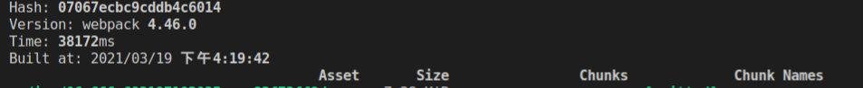
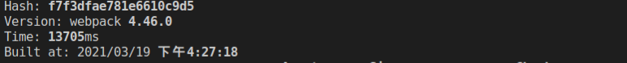

### 1. 新开一个webpack文件，引入cleanWebpackPlugin

### 2. 引入cahe-loader, thread-loader

### 3. 大部分打包时间花费在：npm install 方法中

## 测试结果  hewentao-webpack-update

## 1. 引入cahe-loader(一期)

###   问题：webpack中cache-loader中package改变会更新吗

  https://segmentfault.com/a/1190000021768648

- ## 缓存loader的结果

  **我们可以基于一种假设：如果某个文件内容不变，经过相同的loader解析后，解析后的结果也不变**

  **于是，可以将loader的解析结果保存下来，让后续的解析直接使用保存的结果**

###  a.  旧版本打包时间: 38s左右

### b.  新版本打包时间: 17s左右

## 2. css tree shaking(二期)

经过实验，.vue里面的写在style里的css无法tree shaking，但是外部导入的css可以。tree shaking设计的初衷应该是shaking掉第三方引入的样式中无用的代码。业务代码，尤其像.vue这样的组件化开发tree shaking的使用有限，估计就直接抛弃，不支持了

css Module无法正常使用

## 3. 代替CommonJS为Es6 Module

## 开发优化打包方案

### 1. 去掉npm install，开发环境没必要(拉取新的包)  －　需要商榷

### 2. 对webpack进行优化　

### 3. 写入一个新的脚本

## 线上环境优化方案

1. 是否开启css tree shaking (`purgecss-webpack-plugin`)

## 疑问

### 1. loader和plugin的执行顺序

### 2. webpack如何启动按需加载

### (3) tree-shaking

webpack会从入口模块出发寻找依赖关系

当解析一个模块时，webpack会根据ES6的模块导入语句来判断，该模块依赖了另一个模块的哪个导出

webpack之所以选择ES6的模块导入语句，是因为ES6模块有以下特点：

1. 导入导出语句只能是顶层语句
2. import的模块名只能是字符串常量
3. import绑定的变量是不可变的

这些特征都非常有利于分析出稳定的依赖

在具体分析依赖时，webpack坚持的原则是：**保证代码正常运行，然后再尽量tree shaking**

所以，如果你依赖的是一个导出的对象，由于JS语言的动态特性，以及`webpack`还不够智能，为了保证代码正常运行，它不会移除对象中的任何信息

因此，我们在编写代码的时候，**尽量**：

- 使用`export xxx`导出，而不使用`export default {xxx}`导出
- 使用`import {xxx} from "xxx"`导入，而不使用`import xxx from "xxx"`导入

依赖分析完毕后，`webpack`会根据每个模块每个导出是否被使用，标记其他导出为`dead code`，然后交给代码压缩工具处理

代码压缩工具最终移除掉那些`dead code`代码

### (4) clean-webpack-plugin清理不掉

- 解决方法
- output中添加－path: path.resolve(__dirname,'dist'),

### 项目

1. 打点(exposure),旧版本打点，新的打点方案
2. 打点工具
3. webpack优化(cache-loader,import, css-tree-shaking)
4. px2pw适配(loader) , margin-top: 60px/*keep*/，相当于注释，会自己删掉
5. 懒加载(data-src)