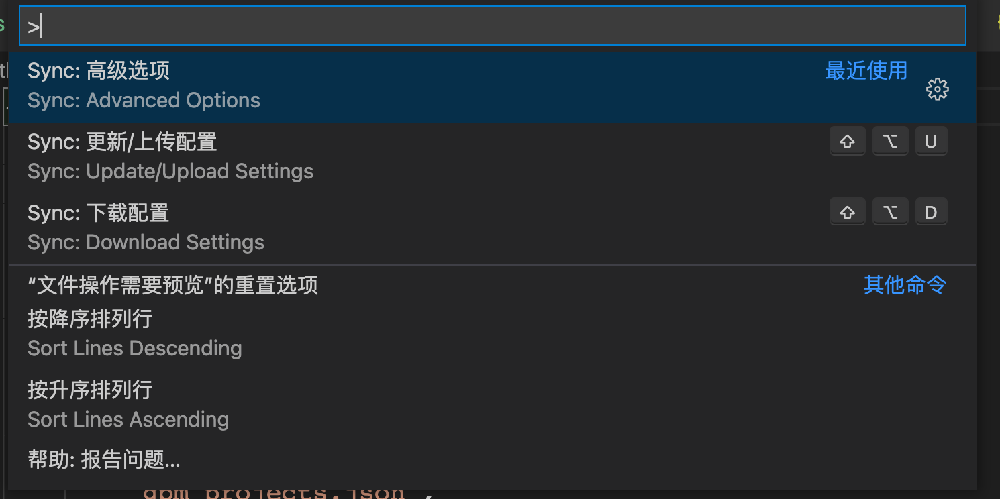
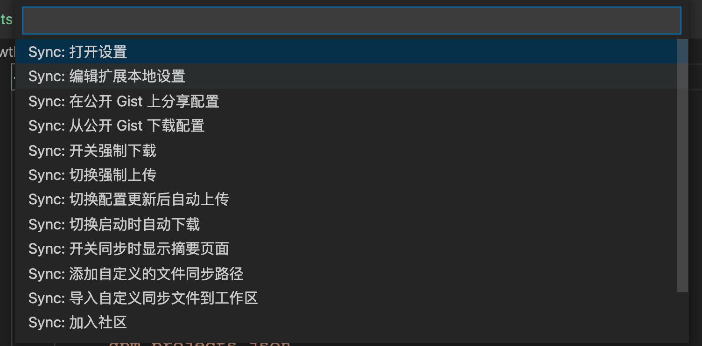

### 1. 路径提示插件

### 2.  setting sync 　插件的同步

-  下载setting sync
- 得到github  **gist id**  https://gist.github.com/hewentaoc/8e28a6c25a660ba80d548240b7cea9d4
- 得到github token  https://github.com/settings/tokens

### 3. 脚本

```sh
branch_name=`git symbolic-ref --short -q HEAD` #获取分支名称

echo '请输入commit信息:'
read commit_msg
git add -A #将内容从工作目录添加到暂存区
git commit -m $commit_msg #主要是将暂存区里的改动给提交到本地的版本库
git push origin $branch_name:$branch_name #是将本地分支的更新推送到远程主机


#!/bin/bash
branch_name=`git symbolic-ref --short -q HEAD`

LOGS=`git log --decorate --pretty=oneline -1`
TEST=`echo "${LOGS}" | grep "tag: v-${branch_name}"`
echo $TEST

if [ -n "$TEST" ] ;then  # 第一次提交
echo "请输入commit 信息："
read commit_msg
git add -A
git commit -m "$commit_msg"
git push -f origin $branch_name:$branch_name
else # 非第一次提交
git add -A
git commit --amend
branch_name=`git symbolic-ref --short -q HEAD`
git push -f origin $branch_name:$branch_name
fi
# git add -A
# git commit --amend
# branch_name=`git symbolic-ref --short -q HEAD`
# git push -f origin $branch_name:$branch_name
```

### 4. github提交，却不显示提交记录

最后确认，是git设置的邮箱必须和github的邮箱一致，才会显示


## 5. 

​    `git checkout develop-test`

​    `git pull origin develop-test --rebase=true`

​    本地没有develop-test

​    `git checkout -b develop-test origin/develop-test`


​    `git merge <feture分支> --no-ff`

​    解决冲突后，  

​    `git add -A`    

​    `git commit -m <合并信息>`  

​    之后再push本地develop-test分支

​    `git push origin develop-test:develop-test`

### 6.找回commit提交记录 git reflog


## 7. Gist

Gist : **8e28a6c25a660ba80d548240b7cea9d4**

token: **35ae09210542bfa5272058b445dce93f4d7adf90**





https://www.jianshu.com/p/3e12eb154b89