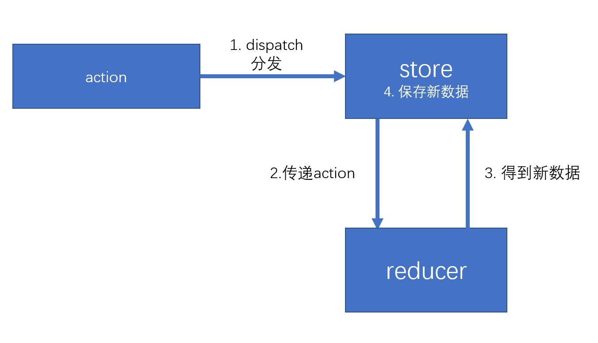

l

[TOC]

 ## 1. 入口文件方法导出去　√

- export { default as createStore } from "./createStore"

  

## 2. 方法学习　√

```js
　Object.getPrototypeOf(obj) === Object.prototype　//得到原型
  Object.setPrototypeOf(Son.prototype,Father.prototype)　//继承原型
　obj.isProtoTypeOf(Object)//测试一个对象是否存在于另一个对象的原型链上
```


## 3.  vue源码 

　     **Vue3.0**　

　　**nextTick**: Promise, 微任务,setTimeout()

## 4. diff算法


## 5. Object.defineProperty()　√

###　使用Object.defineProperty(obj,prop,{})进行对象或者数组的代理

  - **代理对象的核心是**需要使用一个新的对象进行之前对象的代理
 	- **代理数组的核心**是重写push等方法，从而进行数组方法监控
 	- 如果对象的层次比较深，需要进行深层次递归 

　### 问题

- Object.defineProperty()只能检测对象,对于数组不能进行监控
- 不能对深层次对象监控
- 后面新加的属性没法进行监控

```js
/**
* 1. Object.defineProperty - 1
*/

let obj = {
    name:'hwt',
    age:13,
    test:[1,2,3],
    love:{
        sing:'song'
    }
}

function proxyMix(obj){
    let proxyObj = {}
    if(obj instanceof Array){
       proxyObj = [];
       for(let i = 0 ; i < obj.length ; i++){
           proxyObj[i] = proxyObjFunc(obj[i]);
       }
       proxyObj = proxyArrFunc(obj)
    }else if(typeof obj == 'object'){
        proxyObj = proxyObjFunc(obj);
    }
    return proxyObj;
}
function proxyObjFunc(obj){
    let proxyObj = {}
    for (const key in obj) {
        Object.defineProperty(proxyObj,key,{
            set(val){
                console.log('set')
                obj[key] = val;
            },
            get(){
                console.log('get');
                return obj[key];
            }
        })
        if(typeof obj[key] == 'object'){
            proxyObj[key] = proxyMix(obj[key]);
        }
    }
    return proxyObj;
}
let protoArr = Array.prototype;
function proxyArrFunc(arr){
    let prototypeObj = {
        push:function(){},
        pop(){},
        shift(){},
        unshift(){}
    }
    Object.defineProperty(prototypeObj,'push',{
        value:(function(){
            return function(...arg){
                console.log('push','数组监控')
                protoArr['push'].apply(this,arg);
                return this.length;
            }
        }())
    })
    arr.__proto__ = prototypeObj;
    return arr;
}

let proxyObj = proxyMix(obj);
```

```js

/**
  2. Object.defineProperty - 2
*/
function observer(obj) {
    if(typeof obj != 'object'){
        return;
    }
    Object.keys(obj).forEach((item)=>{
        let value = obj[item];
        observer(obj[item])//递归监听属性
        Object.defineProperty(obj,item,{
            get(){
                console.log('get '+ item + ':',value)
                return value;
            },
            set(val){
                observer(val);//对赋值为对象的值进行重新监听
                console.log('set '+ item + ':',value)
                value = val;
            }
        })
    })
}
observer(obj)
```

```js

/**
  3. Object.defineProperty - 3
*/
function observer(obj){
    if(typeof obj != 'object'){
        return obj;
    }
    
    let result = new Proxy(obj,{
        set(target,key,value){
            console.log('set',key)
            observer(value)
            Reflect.set(target,key,value);
        },
        get(target,key){
          console.log('get',key)
          let value = observer(Reflect.get(target,key));
          return value;
        }
    })
    return result;
}

```


为什么proxy可以get的时候，再进行深度遍历，而Object.defineProperty不可以?　

> **proxy有传递的参数,可以直接得到此时的target,key,从而得到value**
>
> ***而Object.defineProperty*****中的get事件不具备实施得到value的功能**
>
> **proxy是代理到别的对象上,不会出现死循环**
>
> **Object.defineProperty如果代理到自己的身上会出现死循环**


## 6. proxy　√

### 使用Proxy,Reflect进行对象或者数组的代理

### 优点

- 可以解决新增属性无法进行监控的问题
- 可以直接监控数组

**注:**

- 使用proxy 进行值的监控的时候,必须用返回的代理对象proxyDate调用属性,才能进行属性值的监控

```js
let proxyMixObj = new Proxy(obj,{
    set(target,key,value,proxyObj){
        console.log('proxy set')
        Reflect.set(target,key,value)
    },
    get(target,key,proxyObj){
        console.log('proxy get')
        return Reflect.get(target,key)
    }
})
```

## 7 . Promise √

```js
 function MyPromise(func1){
    this.resolveArr = [];
    this.rejectArr = [];
    this.status = 'pedding';
    this.resloveParams = '';
    this.rejectParams = '';
    let self = this;
    function reslove(params){
        if(self.status != 'pedding'){
            return;
        }
        self.resloveParams = params;
        self.status = 'reslove';
        self.resolveArr.forEach((elem)=>{
            elem();
        })
    }
    function reject(params){
        if(self.status != 'pedding'){
            return;
        }
        self.rejectParams = params;
        self.status = 'reject';
        self.rejectArr.forEach((elem)=>{
            elem();
        })
    }
    try {
      func1(reslove,reject);
    } catch (error) {
      console.log('iii')
      reject(error)
    }
 }
 MyPromise.prototype.handleNextValue = function(nextPromise,returnParams,reslove,reject){
    if(returnParams instanceof MyPromise){
       returnParams.then((params)=>{
          reslove(params)
        },(err)=>{
          reject(err)
        })
    }else{
        reslove(returnParams)
    }
 }
 MyPromise.prototype.then = function(succ,fail){
    if(!succ){
        succ = function(data){
            return data;
        }
    }
    if(!fail){
        fail = function(error){
            throw new Error(error);
        } 
    }
    let self = this;
    var nextPromise = new MyPromise((reslove,reject)=>{
        if(this.status == 'reslove'){
           setTimeout(()=>{
              try {
                let returnParams = succ(self.resloveParams);
                self.handleNextValue(nextPromise,returnParams,reslove,reject)
              } catch (error) {
                console.log(error)
                reject(error)  
              }
           },0)
        }
        if(this.status == 'reject'){
            setTimeout(()=>{
                try {
                   let returnParams = fail(self.rejectParams);
                   self.handleNextValue(nextPromise,returnParams,reslove,reject)
                } catch (error) {
                   reject(error)
                }
            },0)
        }
        if(this.status == 'pedding'){
            if(succ){
                self.resolveArr.push(()=>{
                    setTimeout(()=>{
                        try {
                         let nextValue = succ(self.resloveParams);
                         self.handleNextValue(nextPromise,nextValue,reslove,reject)
                        } catch (error) {
                           console.log(909)
                           reject(error)    
                        }
                    },0)
                })
            }
            if(fail){
                self.rejectArr.push(()=>{
                    setTimeout(()=>{
                       try {
                         let nextValue = fail(self.rejectParams);
                         self.handleNextValue(nextPromise,nextValue,reslove,reject)
                       } catch (error) {
                         console.log(788)
                         reject(error)
                       }
                    },0)
                })
            }
        }
    })
    return nextPromise;
 }

 MyPromise.prototype.catch = function(reject){
    return this.then(null,reject)
 }
```


## 8. 迭代器　√

### 迭代器和可迭代协议

> 解决副作用的 redux 中间件
> redux-thunk：需要改动action，可接收action是一个函数
> redux-promise：需要改动action，可接收action是一个promise对象，或action的payload是一个promise对象
> 以上两个中间件，会导致action或action创建函数不再纯净。
> redux-saga将解决这样的问题，它不仅可以保持action、action创建函数、reducer的纯净，而且可以用模块化的方式解决副作用，并且功能非常强大。
> redux-saga是建立在ES6的生成器基础上的，要熟练的使用saga，必须理解生成器。
> 要理解生成器，必须先理解迭代器和可迭代协议。

```js
//迭代器
let iterator = {
    a:1,
    next(){
        return {
            value:this.a++,
            done: this.a > 4
        }
    }
}
//迭代器创建函数
function createIterator(arr){
    let i = 0;
    return {
        next(){
            return {
                value:arr[i++],
                done: i > arr.length
            }
        }
    }
}
//Symbol.iterator 可迭代协议
let arrs = [3,44,99,2,1]
let iter = arrs[Symbol.iterator]();
for(let i = 0 ; i < arrs.length ;i++){
    console.log(iter.next())
}
```

### 迭代

类似于遍历

遍历：有多个数据组成的集合数据结构（map、set、array等其他类数组），需要从该结构中依次取出数据进行某种处理。

迭代：按照某种逻辑，依次取出下一个数据进行处理。

### 迭代器 iterator (是个对象)

JS语言规定，如果一个对象具有next方法，并且next方法满足一定的约束，则该对象是一个迭代器（iterator）。

next方法的约束：该方法必须返回一个对象，该对象至少具有两个属性：

- value：any类型，下一个数据的值，如果done属性为true，通常，会将value设置为undefined
- done：bool类型，是否已经迭代完成

通过迭代器的next方法，可以依次取出数据，并可以根据返回的done属性，判定是否迭代结束。

### 迭代器创建函数 iterator creator

它是指一个函数，调用该函数后，返回一个迭代器，则该函数称之为迭代器创建函数，可以简称位迭代器函数。


### 可迭代协议

ES6中出现了for-of循环，该循环就是用于迭代某个对象的，因此，for-of循环要求对象必须是可迭代的（对象必须满足可迭代协议）

可迭代协议是用于约束一个对象的，如果一个对象满足下面的规范，则该对象满足可迭代协议，也称之为该对象是可以被迭代的。

可迭代协议的约束如下：

1. 对象必须有一个知名符号属性（Symbol.iterator）
2. 该属性必须是一个无参的迭代器创建函数

### for-of循环的原理

调用对象的[Symbol.iterator]方法，得到一个迭代器。不断调用next方法，只有返回的done为false，则将返回的value传递给变量，然后进入循环体执行一次。


## 9. 生成器 √

### 生成器 generator

```js
 //生成器创建函数

 function* createGenerator(){

 }
 let generator = createGenerator(); //迭代器和可迭代对象
// generator.next == generator[Symbol.iterator]().next

//传递yield的返回值
function* createGenerator2() {
   let val = yield asyncFunc();
   console.log(1111,val);
}
let generator2 = createGenerator2();

function getData(generator){
    let next = function(val){
        let {value,done} = generator.next(val);
        if(done){
            return
        }else{
           if(value instanceof Promise){
                value.then((data)=>{
                  next(data)
                })
           }else{
               next(value)
           }
        }
    }
    next();
}
getData(generator2)
```


### generator

生成器：由构造函数Generator创建的对象，该对象既是一个迭代器，同时，又是一个可迭代对象（满足可迭代协议的对象）

```js
//伪代码

var generator = new Generator();
generator.next();//它具有next方法
var iterator = generator[Symbol.iterator];//它也是一个可迭代对象
for(const item of generator){
    //由于它是一个可迭代对象，因此也可以使用for of循环
}
```

**注意：Generator构造函数，不提供给开发者使用，仅作为JS引擎内部使用**

### generator function 

生成器函数（生成器创建函数）：该函数用于创建一个生成器。

ES6新增了一个特殊的函数，叫做生成器函数，只要在函数名与function关键字之间加上一个*号，则该函数会自动返回一个生成器

生成器函数的特点：

1. 调用生成器函数，会返回一个生成器，而不是执行函数体（因为，生成器函数的函数体执行，收到生成器控制）
2. 每当调用了生成器的next方法，生成器的函数体会从上一次yield的位置（或开始位置）运行到下一个yield
   1. yield关键字只能在生成器内部使用，不可以在普通函数内部使用
   2. 它表示暂停，并返回一个当前迭代的数据
   3. 如果没有下一个yield，到了函数结束，则生成器的next方法得到的结果中的done为true
3. yield关键字后面的表达式返回的数据，会作为当前迭代的数据
4. 生成器函数的返回值，会作为迭代结束时的value
   1. 但是，如果在结束过后，仍然反复调用next，则value为undefined
5. 生成器调用next的时候，可以传递参数，该参数会作为生成器函数体上一次yield表达式的值。
   1. 生成器第一次调用next函数时，传递参数没有任何意义
6. 生成器带有一个throw方法，该方法与next的效果相同，唯一的区别在于：
   1. next方法传递的参数会被返回成一个正常值
   2. throw方法传递的参数是一个错误对象，会导致生成器函数内部发生一个错误。
7. 生成器带有一个return方法，该方法会直接结束生成器函数
8. 若需要在生成器内部调用其他生成器，注意：如果直接调用，得到的是一个生成器，如果加入*号调用，则进入其生成器内部执行。如果是```yield* 函数()```调用生成器函数，则该函数的返回结果，为该表达式的结果

## 10. loader √

- **loader**本质也是一个模块，最后会通过module.exports导出东西
-  loader本质上是一个函数，它的作用是将某个源码字符串转换成另一个源码字符串返回**

- 模拟style-loader加载器

 ```js
module.exports = function (sourceCode) {
   var code = `var style = document.createElement("style");
   style.innerHTML = \`${sourceCode}\`;
   document.head.appendChild(style);`;
   return code
}
 ```


## 11. plugin 　√

```js
module.exports = class MyPlugin {
    apply(compiler){//初始化
        compiler.hooks.emit.tap("FileListPlugin", complation => {//注册钩子函数
          complation.assets['index.vue'] = {
            source(){
                return 'new Vue()'
            },
            size(){
                return 0;
            }
          }
        })
   }
}
```


## 12. set	√

- Tools

## 13. map　√

- Tools


## 14. 正则表达式　√

- Tools

## 15. 文件引入script

随机排座位[算法]

##  16. React-Router 　√

​	   react-router-dom


  \9. history

​           A -> B -> C
​           为了网页的性能,单页面操作
​           使用history解决单页面的回退问题

​           history.back()    回到之前的页面
​           history.forward() 回到后面的页面


​           把查询状态插入到历史记录中

​           history.pushState({

​           },null,"#val")

​           {

​               { },         存储的状态,

​               null,        没有浏览器支持

​               url:#val     定义一个url  

​           }

​        页面变换触发的事件:

​        注:两个事件同时发生,会先触发Popstate事件

​       (1)  页面倒退(前进)的时候会触发此事件

​           注:只要url发生变化就会触发popstate事件

​           window.addEventListener('popstate',function(e){


​           })

​       

​       (2) 页面倒退(或者前进)的时候锚点发生变化,就会触发此事件

​           注:只要锚点变了就会触发haschange事件

​              哈希值变了,就会触发haschange事件

​           window.addEventListener('haschange',function(){

​           }) 

## 17. Redux,Vuex , dva √

### 1. Vuex的实现			

   ### 　需要解决的问题

> 1. **如何使用Vuex**
> 2. **如何在全局使用$store**
> 3. **如何实现$store中state的动态更新**
> 4. **如何实现$store中getters中属性动态更新**
> 5. **如何实现modules,namespaced**
> 6. **如何实现mutations,actions,如何触发对应的函数**
> 7. **如何实现mapState**


### (1) .**如何使用Vuex**

```js
Vue.use(Vuex)
```

***Vue.use()***使用自定义组件

  需要自定义***install***属性的函数或者方法

才能在全局使用组件中的方法

Vue.use() 方法至少传入一个参数，该参数类型必须是 Object 或 Function，如果是 Object 那么这个 Object 需要定义一个 install 方法，如果是 Function 那么这个函数就被当做 install 方法。在 Vue.use() 执行时 install 会默认执行，当 install 执行时第一个参数就是 Vue，其他参数是 Vue.use() 执行时传入的其他参数。      

### (2) . 如何在全局使用$store

```js
new Vue({
  name:'root',
  render: h => h(App),
  store
}).$mount('#app')
```

在对Vue初始化的时候,传递的属性***store***会挂载在***Vue对象的options中***,

可以通过***Vue.mixin()***进行全局混入

****

```js
export default function install(_Vue){
  Vue = _Vue;
  //将$store混合到每个实例中
  Vue.mixin({
      beforeCreate() {
        if(this.$options.store){
          this.$store = this.$options.store;
        }else{
          if(this.$options.parent && this.$options.parent.$store){
            this.$store = this.$options.parent.$store
          }
        }
      },
  })
}
```
###  (3). **如何实现$store中state的动态更新**

> 1. **对store中的配置项进行递归遍历得到处理后的state对象**
> 2. **定义一个Vue实例,将state值当成Vue的data,进行数据的监听**

```js
{
    "state": {
        "name": "hwt",
        "count": 44,
        "test": {
            "age": 24,
            "three": {
                "name": "a"
            }
        }
    }
}
```

### (4). **如何实现$store中getters中属性动态更新**

> 1. 在声明的Vue实例中，通过Vue中的computed属性来动态监听getters函数的变化　
> 2. 将计算属性(key,value)代理到this.getters中

 **在state数据发生变化的时候，会触发页面重新更新**，this.getters会被重新调用，得到此时computed属性返回最新的值，实现数据的动态更新

**可能是计算属性更改，导致get函数反复运行**

**可能是页面刷新，调用$store.getters.add,从而得到计算属性**

　state数据发生变化时候

```js
        this._computer = {

        }
        this.getters = {};
        let self = this;
        Object.keys(this._getters).forEach(item=>{
            let func = this._getters[item];
            this._computer[item] = function(){
                return func(this)
            }
            Object.defineProperty(this.getters,item,{
                get:function(){
                    return self._vm[item];
                }
            })
        })
```

### (5) 如何实现modules,namespaced

 1. 进行递归遍历的时候，modules会作为path逐级传递

 2. 没有namespaced，会把同名的函数存储在一个数组中

 3. 在store遍历阶段会注册***mutation函数***存储对象

 4. 然后通过commit方法进行触发

    ```js
    ['test']
    //没有namespaced
    this.mutation = {
        change:[function(){
            
        },function(){
            
        }],
        change2:[function(){
            
        }]
    }
    //有namespaced
    this.mutation = {
        change:[function(){
            
        }],
        'test/change':[function(){
            
        }]
    }
    
    ```

### (6) **如何实现mutations,actions,如何触发对应的函数**

　　通过commit,dispath,触发对应的函数

```js
 this.$store.commit('change',num)
 this.$store.commit('test/change',num)
    /*
      触发mutation函数
    */
commit = (type,payload)=>{
    if(this._mutations[type]){
        this._mutations[type].forEach((item)=>{
            item(payload);
        })
    }else{
        throw new Error(`${type} is not a function!`)
    }
}
```


### (7) **如何实现mapState**

将用到的state属性放在Vue的计算属性中

```js

function mapState(params,extra){
    let {type , path } = handleMap(params,extra);
    let res = {}
    type.forEach((item)=>{
        res[item] = function(){
           let state =　{};
           let root = this.$store.state;
           state = path.length > 0 ? getContextState(root,item,path) : root[item];
           return state; 
        }
    })
     
    return res;
}
```


### 2. Redux的实现

　　　 **### 需要解决的问题**

> 1. 如何在全局使用Redux中的state
> 2. 如何实现state的动态更新
> 3. 如何触发state的更新(dispatch)
> 4. redux中如何进行异步操作

Redux的组成解构

let store =  ***createStore***(reducer,10,***applyMiddleware***());

```js
let action = {
    type:'',
    payload:''
}

function reducer(state,action){
    switch(action.type){
        case 'add':
            return state + action.payload;
        default:
            return state;
    }
}

let store = createStore(reducer);
store.dispatch(action);

function dispath(aciton){
   state = reducer(state,action);
}

```



### (1) 如何在全局使用Redux中的state

在React中不存在混入到React全局的方法，需要借助执行期上下文context

```react

let ctx = React.createContext();//执行期上下文
//在Provider组件内的子组件都可以拿到执行上下文的值
 <ctx.Provider value={store}>
     {this.props.children}
 </ctx.Provider>
//Consumer拿到store中的值
<ctx.Consumer>
	(store)=>{
        
    }
</ctx.Consumer>
上下文提供者（Context.Provider）中的value属性发生变化(Object.is比较)，会导致该上下文提供的所有后代元素全部重新渲染，无论该子元素是否有优化（无论shouldComponentUpdate函数返回什么结果）
```

(2)  如何实现state的动态更新

```js
//createStore()提供subscribe监听函数，在state值变化的时候会触发函数,
//this.setState()使组件的更新

function connect(mapStateToProps,mapDispatchToProps){
    return function Hoc(Comp) {
        //对于该组件，只有它需要的数据发生变化时才会重新渲染
        return class CompWrap extends PureComponent {
            static contextType = ctx;//得到上下文数据
            constructor(props,context){
                super(props);
                let {dispatch,getState,subscribe} = context;//得到执行期上下文中的仓库
                this.state = mapStateToProps(getState());//仓库中值的初始化
                subscribe(()=>{//监听仓库中值的改变
                    this.setState(mapStateToProps(getState()))
                })
                this.eventHandles = mapDispatchToProps(dispatch);
            }
            render() {
                return (
                    <Comp {...this.state} {...this.eventHandles}/> 
                )
            }
        }
    }
}
function mapStateToProps(state){
    return {
        number:state.numberReducer
    }
}

function mapDispatchToProps(dispatch){
    return {
        onIncrease:()=>{
            console.log('increase')
            dispatch(createIncreaseAction());
        },
        onDecrease:()=>{
            console.log('decrease')
            dispatch(createDecreaseAction());
        } 
    }
}
```


### (3). 如何触发state的更新(dispatch)

通过封装的mapDispatchToProps,将dispatch方法映射到组件中

### (4). redux中如何进行异步操作

通过在中间件对dispatch方法进行修饰,然后处理完异步操作后，继续dispatch改变state

```js
//(1)中间件redux-thunk
export default function thunk(store){
    return function(next){
        return function(action){
            if(typeof action == 'function') {
                action(store.dispatch,store.getState)
            }else{
                next(action);
            }   
        }
    }
}
export function fetchStudent(){
    return async function(dispatch,getState){
        let msg = await getAllStudents();
        dispatch(getAddUserAction(msg))
    }
}
store.dispatch(fetchStudent())
```

```js
//(2) 中间件redux-promise
export default ({ dispatch }) => next => action => {
    if (!isFSA(action)) {
        //如果不是一个标准的action
        //如果action是一个promise，则将其resolve的值dispatch，否则，不做任何处理，交给下一个中间件
        return isPromise(action) ? action.then(dispatch) : next(action);
    }
    return isPromise(action.payload) ?
        action.payload
            .then(payload => dispatch({ ...action, payload }))
            .catch(error => dispatch({ ...action, payload: error, error: true })) :
        next(action)
}
export function fetchStudents() {
    return new Promise(resolve => {
        setTimeout(() => {
            const action = setStudentsAndTotal([{ id: 1, name: "aaa" }, { id: 2, name: "bbb" }], 2);
            resolve(action)
        }, 3000);
    })
}
store.dispatch(fetchStudent())
```

```js
//(3) saga
function* fetchStudents() {
    //设置为正在加载中
    yield put(setIsLoading(true))
    const condition = yield select(state => state.students.condition); //select指令：用于得到当前仓库中的数据
    //使用call指令，按照当前仓库中的条件
    const resp = yield call(searchStudents, condition);//触发异步事件
    yield put(setStudentsAndTotal(resp.datas, resp.cont))//put相当于dispatch
    yield put(setIsLoading(false));
}

export default function* () {
    yield takeEvery(actionTypes.fetchStudents, fetchStudents);
    console.log("正在监听 fetchStudents")
}

```


## 18. React Fiber

```js
const fiber = {
    stateNode,    // 节点实例
    child,        // 子节点
    sibling,      // 兄弟节点
    return,       // 父节点
}
```

https://segmentfault.com/a/1190000020736966?utm_source=sf-related


## 19. Hook


## 20 . Saga


